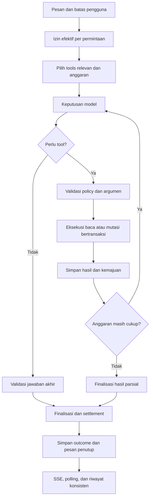

# Analisis kegagalan agent, penggunaan tools, token, dan desain chat

Tanggal: 7 September 2026. Tahap: analisis sebelum implementasi.

## Kesimpulan utama

Prompt pengujian CHR sudah cukup jelas untuk memulai pemeriksaan read-only. Prompt itu tidak meminta AI langsung menyelesaikan konfigurasi tanpa data: justru meminta membaca kondisi router dan meminta informasi tambahan yang diperlukan. Kegagalan yang ditemukan berada pada orkestrasi aplikasi, penanganan akhir run, serta penyajian aktivitas.

Run yang cocok dengan screenshot adalah `cd4e39a0-e203-49fc-960c-197cbedbd02c`. Database menyimpan sembilan tool berhasil, tujuh di antaranya pencarian katalog, tetapi tidak menyimpan satu pun teks jawaban untuk permintaan lab. Durasi 121,677 detik sangat kuat menunjuk pada batas run 120 detik. Cabang timeout di kode memang menyimpan jawaban kosong tanpa penjelasan.

Label “jawaban gagal” pada sembilan panel bukan bukti sembilan tool gagal. Status kegagalan satu run disalin ke setiap panel tool.

## Cakupan dan metode

- Membaca prompt asli dan enam screenshot pengguna.
- Membaca database aplikasi aktif secara read-only: `C:/Users/Administrator/.mikrotik-agent/agent.sqlite`. Database `data/agent.sqlite` di repo tidak memiliki run terkait.
- Menelusuri route chat, agent loop, provider stream, rate limiter, fallback, policy, transaksi, penyimpanan, konteks, SSE, serta komponen chat.
- Memeriksa implementasi katalog pada dependency lokal `@usex/mikrotik-mcp` versi 5.6.0.
- Menjalankan 62 pengujian backend dan 19 pengujian UI yang terkait; semuanya lulus.
- Menjalankan empat reproduksi tambahan menggunakan provider palsu dan SQLite in-memory. Tidak ada panggilan provider AI atau router pada pengujian ini.

Kode kerja sudah memiliki perubahan sebelum audit. Audit tidak mengubah implementasi aplikasi atau perubahan yang sudah ada. Artefak baru: laporan ini dan `tooling/audit-agent-flow.ts`.

Batas kepastian: kode error terminal run terkait tidak dipersistenkan pada jalur guard. Karena itu, timeout adalah inferensi sangat kuat dari waktu, konfigurasi, urutan tool, dan cabang kode; bukan kode error historis yang berhasil dibaca. Audit ini bukan pengujian langsung seluruh fitur aplikasi terhadap router nyata.

## Bukti run aktual

| Metrik | Hasil |
|---|---:|
| Status run | failed |
| Durasi | 121,677 detik |
| Request AI tercatat | 9 |
| Tool dipanggil | 9 |
| Pencarian tool | 7 |
| Pembacaan router | 2 |
| Tool berstatus gagal | 0 |
| Input token kumulatif dari provider | 305.396 |
| Output token kumulatif dari provider | 342 |
| Teks assistant tersimpan | 0 karakter |
| Status transaksi akhir | rolled_back |

Output token provider dapat mencakup pemanggilan fungsi; 342 token tidak berarti ada 342 token jawaban untuk pengguna. Input 305.396 adalah total lintas sembilan request, bukan ukuran satu context window dan bukan perhitungan biaya tagihan. Rata-rata input sekitar 33.933 token per request; rincian cached tokens dan biaya tidak tersedia dalam record ini.

| Urutan | Tool / kueri | Selesai sejak mulai run |
|---|---|---:|
| 1 | find_tools: ip address print | 1,766 dtk |
| 2 | find_tools: ip address | 2,973 dtk |
| 3 | find_tools: ip route print | 3,976 dtk |
| 4 | find_tools: ip firewall filter print | 5,011 dtk |
| 5 | find_tools: ip firewall nat print | 61,873 dtk |
| 6 | find_tools: ip dhcp-client print | 63,139 dtk |
| 7 | list_interfaces | 64,225 dtk |
| 8 | find_tools: ip address print detail | 65,273 dtk |
| 9 | list_ip_addresses | 121,669 dtk |

Tujuh dari sembilan call (77,8%) mencari katalog. Tiga kueri berbeda mencari kemampuan IP address yang sama. Pemeriksaan route, DHCP client, firewall filter, dan NAT belum benar-benar dijalankan dalam run ini.

Total durasi sembilan tool pada activity events hanya sekitar 0,204 detik. Angka “66 mdtk” pada screenshot berarti milidetik. Sebagian besar waktu terjadi di antara tool, bukan pada pembacaan router. Dua jeda sekitar 56 detik konsisten dengan limiter lokal default empat request per menit; tidak ada telemetry antrean per request untuk memastikan pemisahan waktu antrean, jaringan, dan inferensi provider.

## Temuan dan akar masalah

### 1. P0 — Tidak semua penghentian menghasilkan jawaban kegagalan

`apps/api/src/agent/loop.ts:503` menetapkan failed lalu keluar saat deadline tercapai. Cabang batas tool dan pengulangan juga memakai pola ini. Penyimpanan normal di baris 666 menggunakan `assistantText` apa adanya; pembentukan pesan penjelasan hanya berada pada `catch`, sekitar baris 719.

Akibatnya, provider tidak perlu melempar exception untuk membuat pengguna kehilangan jawaban. Run bisa berakhir failed dengan teks kosong, seperti bukti database. Instruksi prompt “jelaskan jika gagal” tidak membantu karena model tidak mendapat giliran berikutnya.

`use-run-events.ts:139` menyelesaikan tampilan run saat menerima terminal event, tetapi tidak mengubah payload error menjadi pesan chat. Timeline tersimpan hanya memasukkan delta teks dan event tool; kode error guard tidak masuk ke pesan/usage. Riwayat setelah reload kehilangan alasan rinci.

Perbaikan: satu fungsi finalisasi untuk seluruh jalur selesai, batas, exception, pembatalan, dan restart. Simpan outcome terstruktur, alasan, hasil parsial, dan langkah pemulihan. Jika AI tidak dapat menjawab, backend membuat pesan singkat tanpa request AI tambahan. UI juga perlu fallback untuk pesan lama yang sudah kosong.

### 2. P0 — Kehabisan langkah atau output kosong bisa dianggap berhasil

`finalStatus` dimulai sebagai completed. Loop yang menghabiskan `maxSteps` tidak menetapkan kegagalan/incomplete. Giliran tanpa tool dianggap jawaban akhir meskipun `stepText` kosong. `finishReason` diterima provider client tetapi diabaikan agent loop; provider client juga memperlakukan stream berakhir tanpa finish reason sebagai done.

Reproduksi offline memastikan dua kasus: batas satu langkah setelah sebuah tool menghasilkan completed dengan teks kosong; respons provider kosong juga completed.

Perbaikan: definisikan syarat selesai eksplisit. Kehabisan langkah, output terpotong, stream tidak lengkap, dan jawaban kosong memiliki outcome berbeda. Sisakan anggaran untuk penyusunan jawaban. Jangan menaikkan semua batas sebagai pengganti perbaikan ini.

### 3. P0 — Izin Write connector tidak dipisahkan dari maksud permintaan

`apps/api/src/routes/chat.ts:563` membuka transaksi sebelum model bekerja ketika mode connector Write. Pengecualian saat ini hanya sapaan sederhana. Prompt lab jelas melarang perubahan langsung, tetapi transaksi tetap dibuka; database merekam active lalu rolled_back.

`loop.ts:623` menghitung aksi transaksi untuk tool pada mode Write tanpa menyaring risiko efektif. Ketujuh pencarian dan dua pembacaan tercatat menjadi sembilan aksi transaksi. Ini bukan sembilan perubahan konfigurasi; tidak ada tool mutasi dalam daftar eksekusi run tersebut.

Perbaikan: kemampuan connector, izin per permintaan, dan risiko tool harus menjadi tiga hal berbeda. Permintaan “hanya baca / tampilkan perintah untuk saya” membatasi run menjadi read-only walaupun connector mendukung Write. Batas ini harus ditegakkan backend. Transaksi baru dibuka ketika mutasi yang diizinkan benar-benar akan dijalankan; hanya mutasi aktual yang dihitung.

Perubahan ini harus menyesuaikan dispatcher: saat ini ia membandingkan mode snapshot dengan mode connector secara sama persis. Mengganti snapshot menjadi read-only saja ketika connector masih Write akan menyebabkan POLICY_CHANGED. Perlu representasi pembatasan per-run tersendiri dan validasi ulang versi izin connector.

### 4. P1 — Discovery mendorong pencarian berulang tanpa memajukan pekerjaan

Deskripsi `find_tools` dependency lokal menyatakan ALWAYS call this tool FIRST. Instruksi kuat itu tetap berada pada 300 karakter awal deskripsi yang dikirim aplikasi. Hasil pencarian default mengembalikan delapan kandidat beserta deskripsi dan parameter. Screenshot memperlihatkan kandidat tampilan interaktif dan operasi yang tidak langsung cocok dengan pembacaan yang diminta.

`selectRelevantTools` memilih maksimal 48 tool melalui kecocokan substring pesan panjang. Seluruh tool docs diberi prioritas sangat tinggi; tidak ada batas token schema, cakupan fase, atau preferensi khusus untuk operasi baca pada permintaan lab. `providerTools` dibentuk sekali sebelum loop dan tidak diperbarui sesudah discovery.

Model dapat diberi katalog yang cukup besar sekaligus terdorong mencari katalog berulang. Tool yang baru ditemukan juga belum tentu hadir dengan schema langsung pada request berikutnya.

Perbaikan: tool umum yang relevan tersedia langsung; pencarian hanya untuk kemampuan yang belum tersedia. Discovery harus memuat schema yang dipilih untuk request berikutnya atau memberi jalur invoke yang valid dan tunduk pada policy. Gunakan deskripsi ringkas milik aplikasi, pemeringkatan berdasarkan tujuan dan risiko, serta batas ukuran schema. Hasil pencarian memberi sedikit kandidat relevan; jangan menghilangkan parameter penting dengan pemotongan sembarang.

### 5. P1 — Pengulangan ditangani sebagai string, bukan kemajuan

`loop.ts:594` menggunakan nama tool dan JSON mentah sebagai cache key. Perubahan urutan key/whitespace tidak kanonis. Kueri “ip address”, “ip address print”, dan “ip address print detail” tidak dianggap sama meskipun tujuan pencariannya sama. Guard identik tidak menghentikan rangkaian discovery pada kejadian ini.

Cache berlaku tanpa membedakan pembacaan, mutasi, hasil gagal, atau perubahan kondisi router. Reproduksi tambahan menunjukkan hasil gagal yang diambil dari cache malah mengirim event `tool.completed` ke UI.

Perbaikan: serialisasi argumen kanonis; pencarian memiliki normalisasi kueri dan indikator discovery sudah terpenuhi. Cache hasil sukses baca hanya selama konteks router masih cocok; batalkan cache relevan setelah mutasi. Verifikasi setelah perubahan harus membaca kondisi baru. Hasil gagal tetap gagal. Mutasi memerlukan idempotency dan pemeriksaan keadaan, bukan cache generik.

### 6. P1 — Anggaran waktu tidak menyatu dengan antrean provider

Konfigurasi `.env` proyek: 12 langkah, 30 tool, 120.000 ms. Limiter default: empat request/menit; maksimum menunggu antrean lima menit (`rate-limiter.ts:35`). Dengan satu tool per request, sembilan request memasuki jendela menit ketiga sebelum jawaban akhir.

Deadline diperiksa di awal giliran, bukan sebagai sinyal timeout aktif yang membatalkan antrean/request/tool. Permintaan yang masuk sebelum batas dapat menunggu melewati batas, menjalankan tool, lalu dihentikan pada giliran berikutnya. Batas juga belum mencakup seluruh persiapan dan settlement route.

Perbaikan: koordinasikan antrean, deadline keseluruhan, timeout provider/tool, dan cadangan waktu finalisasi. Tampilkan status “Menunggu giliran provider” ketika memang antre, tanpa mengaku sedang membaca router. Hormati batas provider; jangan menghapus limiter untuk menyembunyikan gejala. Gabungkan pembacaan independen dalam satu keputusan model; eksekusi dapat tetap berurutan jika sesi SSH mengharuskannya.

### 7. P1 — Akumulasi token disajikan sebagai context window terakhir

Backend menjumlahkan `promptTokens` lintas request. `ContextMeter.tsx:38` memakai jumlah tersebut untuk menghitung persentase context window dan melabelinya “Input terakhir”. Dua besaran berbeda tercampur. Metadata juga mengikuti konfigurasi provider yang diambil komponen, bukan selalu model efektif request terakhir.

Belum ada batas total token per-run yang ditegakkan loop. `maxTokens` yang diberikan ke stream adalah batas output per request. Pembatasan 48 tool membatasi jumlah, bukan ukuran schema. History, hasil pencarian, dan output tool dikirim kembali dalam request lanjutan.

Perbaikan: catat `lastRequestInputTokens`, total token run, jumlah upaya request, penggunaan per provider/model, cached tokens jika tersedia, dan estimasi yang diberi label. Context meter menggunakan ukuran request terakhir atau estimasi request berikutnya. Biaya dan total token berada pada detail penggunaan terpisah. Terapkan budget per fase dan per run, dengan cadangan finalisasi.

### 8. P1 — Pemulihan belum mempertahankan kemajuan tugas

History loop melewati seluruh pesan assistant failed/cancelled (`loop.ts:461`), termasuk hasil berguna yang mungkin ada. Tombol Regenerate mengirim ulang prompt sebelumnya. Tombol tersebut hanya muncul jika `m.content.text` ada (`ChatPanel.tsx:446`), sehingga kasus jawaban kosong justru kehilangan jalan pemulihan itu.

Checkpoint provider hanya berupa Map in-memory dengan prompt dan metadata (`rate-limiter.ts:599`); bukan penyimpanan lengkap hasil pembacaan, pekerjaan tersisa, dan state tool yang bertahan restart. Kalimat fallback “Tidak ada tool tulis yang dijalankan” juga tidak selalu bisa dijamin pada giliran lanjutan sebuah run Write.

Perbaikan: simpan checkpoint tugas yang berisi batas izin, hasil baca dengan waktu/target, pekerjaan tersisa, serta outcome transaksi. Lanjutkan pekerjaan yang belum selesai; validasi kesegaran hasil dan keadaan transaksi sebelum menggunakan ulang data. Bedakan tombol “Lanjutkan pemeriksaan” dari “Mulai ulang”. Klaim perubahan harus berasal dari catatan eksekusi dan settlement.

### 9. P1 — Penyimpanan outcome tersebar dan dapat berbeda antarjalur

Route menahan terminal SSE sampai settlement, yang merupakan fondasi baik. Namun loop sudah menyimpan status pesan/run sebelum settlement. Poller UI memeriksa status database setiap tiga detik, sehingga berpotensi menganggap selesai lebih dini. Jika settlement kemudian gagal, route memperbarui run tetapi tidak menyelaraskan pesan assistant yang sudah tersimpan.

Terminal events juga tidak dicatat oleh fungsi persist aktivitas route. Hub menyimpan replay di memori. Restart menandai run aktif menjadi failed tetapi tidak membuat pesan pemulihan setara finalisasi normal.

Perbaikan: state `finalizing` yang belum terminal, kemudian satu outcome otoritatif setelah settlement. Persist terminal reason dan event sequence yang stabil sebelum broadcast. SSE, polling, reload, export, dan riwayat harus menampilkan outcome sama. Jangan menganggap browser terputus sebagai bukti run gagal; perilaku reconnect yang sudah ada perlu dipertahankan.

### 10. P1 — UI membentuk satu grup baru untuk setiap tool

`ChatPanel.tsx:428` dan baris 501 merender `RunPipeline steps={[block.step]} defaultOpen` untuk setiap blok tool. Komponen grup selalu menerima array satu elemen, sehingga judul selalu “1 langkah”. Status run gagal ikut diberikan ke masing-masing grup tersimpan.

Lapisan visual menjadi bubble assistant → kartu proses → baris tool → panel terminal. Detail teknis terlalu mendominasi. Nama tool seperti “find tools” kurang membantu pengguna memahami tujuan. Durasi grup menjumlahkan waktu tool saja dan tidak menjelaskan waktu tunggu AI. Konten berpotensi melebar/menyempit mengikuti panjang hasil karena kolom assistant hanya memakai max-width.

Perbaikan: satu ringkasan aktivitas untuk satu fase kerja, dengan baris tool di dalamnya. Bila ada penjelasan assistant yang bermakna di tengah proses, pertahankan urutan fase-teks-fase; jangan menggabungkan semua aktivitas dengan mengorbankan kronologi. Status akhir run ditampilkan sekali di bawah hasil, sementara setiap tool mempertahankan statusnya sendiri.

### 11. P2 — Normalisasi output dan tampilan detail belum terpisah

Executor hanya mengambil content bertipe text dan tidak meneruskan `structuredContent`. Hasil dipotong lagi menjadi 8.000 karakter untuk model, 1.500 untuk event, dan 500 untuk ringkasan eksekusi; potongan ini tidak selalu memberi tanda bahwa data belum lengkap. Pemotongan tabel firewall/routing dapat menghilangkan baris yang menentukan kesimpulan.

Perbaikan: envelope hasil yang mencakup status, data terstruktur, ringkasan, jumlah baris, penanda truncated, dan referensi output aman. Model menerima data yang diperlukan; detail teknis dapat diminta/dibuka terpisah. Hasil nol baris yang valid harus dibedakan dari tool gagal, bukan diperintahkan diverifikasi berulang hanya karena kosong.

### 12. P2 — Compact otomatis belum tersambung dan retry perlu batas output

Preferensi `autoCompact` dan ambangnya tersedia, tetapi penelusuran pemakaiannya menemukan UI/penyimpanan preferensi tanpa pemicu pada loop chat. Helper `shouldCompact` tidak dipakai di jalur produksi. Compaction manual tidak menyelesaikan besarnya schema tools atau akumulasi hasil dalam run aktif. History juga memotong pesan secara statis, berpotensi membuang batas instruksi di bagian akhir pesan panjang.

Pada retry/fallback streaming, delta teks diteruskan sebelum keberhasilan satu attempt diketahui. Retry setelah output parsial dapat mencampur jawaban antarattempt. Ini temuan dari kode, bukan penyebab yang teramati pada run lab tanpa teks.

Perbaikan: sambungkan budgeting nyata ke kompaksi bila diperlukan, pertahankan batas pengguna secara eksplisit, dan pisahkan penggunaan riwayat dari hasil tugas. Retry otomatis hanya jika state output memungkinkan; setelah output parsial, gunakan batas attempt dan perilaku resume yang jelas. Jangan menghabiskan request untuk kompaksi percakapan pendek seperti kasus ini.

## Rancangan pengalaman chat

Tujuan desain: pengguna Windows yang mengelola lab router dapat membaca penjelasan, mengetahui apa yang sedang dikerjakan, dan melanjutkan dari kegagalan tanpa harus membaca log internal. Gunakan fondasi warna netral, tipografi Geist, serta komponen yang sudah ada; perbaikan utama adalah hierarki dan state.

Urutan tampilan yang diusulkan:

1. Kalimat singkat: “Saya akan memeriksa alamat IP, interface, route, DHCP client, firewall, dan NAT. Perubahan konfigurasi akan saya tampilkan sebagai perintah untuk Anda jalankan.”
2. Satu baris aktivitas: “Memeriksa konfigurasi router · 2 dari 6 pemeriksaan”. Ringkasan berubah sesuai bukti event. Detail tertutup saat selesai; aktivitas yang sedang berjalan terlihat ringkas.
3. Jika menunggu limiter, tampilkan alasan menunggu dan perkiraan waktu hanya bila tersedia.
4. Jawaban analisis menjadi konten utama. Hasil tabel/ringkasan berada dalam chat; metadata discovery dan JSON ada di “Detail teknis”.
5. Jika terhenti, satu pesan penutup yang menjelaskan bagian selesai, bagian belum selesai, alasan, dan aksi pemulihan yang benar-benar didukung.

Contoh tampilan kegagalan yang diusulkan, bukan jawaban historis AI:

```text
Saya sudah membaca interface dan alamat IP router.

▸ Pemeriksaan router · 2 dari 6 selesai

Pemeriksaan terhenti karena batas waktu sebelum saya sempat membaca
route, DHCP client, firewall, dan NAT. Analisis topologi belum lengkap.

[Lanjutkan pemeriksaan]   [Lihat detail]
```

Jika outcome perubahan perlu ditampilkan, gunakan hasil transaksi aktual; jangan otomatis menulis “tidak ada perubahan” hanya berdasarkan niat read-only atau status tool terakhir.

Aturan interaksi:

- Tool sukses tetap sukses ketika provider gagal menyusun jawaban. Kegagalan run muncul sekali.
- Detail teknis tertutup secara default dan menggunakan disclosure yang dapat dioperasikan keyboard.
- Tombol lanjut/pemulihan tetap ada ketika teks assistant kosong.
- Scroll mengikuti keluaran hanya ketika pengguna berada dekat bawah; jangan mengganggu pengguna yang membuka hasil lama. Hindari smooth-scroll baru pada setiap token dan hormati reduced motion.
- Lebar kolom assistant stabil; tabel dan kode panjang memakai scroll horizontal lokal. Uji layar 360/768/1440 piksel.
- Status ditulis dengan teks, bukan warna saja. Status penting diumumkan melalui live region yang tidak membacakan setiap token/tool detail.
- Jangan menampilkan milestone persentase palsu ketika jumlah pekerjaan belum diketahui. Jumlah pemeriksaan hanya digunakan bila rencana aktual sudah diketahui.

Arsitektur alur yang diusulkan:



## Urutan implementasi yang disarankan

| Tahap | Pekerjaan | Hasil yang harus dapat ditinjau |
|---|---|---|
| 1 | Finalisasi terpadu, timeout, max steps, empty response, outcome persist | Setiap run berakhir dengan pesan dan status jujur, termasuk setelah reload |
| 2 | Batas read-only per permintaan dan transaksi hanya saat mutasi | Prompt lab tidak membuka Safe Mode atau menawarkan eksekusi write |
| 3 | Pemilihan tool, discovery adaptif, batching baca, cache, token budget | Data tahap 1 terkumpul tanpa tujuh pencarian berantai |
| 4 | Grup aktivitas, status tunggu, detail teknis, pemulihan, konteks | Satu alur chat terbaca; tombol lanjut tersedia pada hasil parsial |
| 5 | Pengujian integrasi mock, lalu smoke read-only pada lingkungan yang diizinkan | Bukti fungsi, efisiensi, dan UI memenuhi skenario asli |

Target evaluasi efisiensi: untuk enam pembacaan yang sudah dikenal, uji alur sekitar 2–4 request model, discovery nol bila tools langsung tersedia, atau satu discovery gabungan bila dibutuhkan. Ini target benchmark untuk desain baru, bukan jaminan untuk setiap model atau kondisi router. Eksekusi backend tetap boleh terdiri dari enam call baca yang transparan di detail. Tujuan penghematan adalah mengurangi perjalanan model dan schema/output berlebih, bukan menyembunyikan call dari pengguna.

Jangan sekadar mengganti model, menaikkan timeout, atau menutup semua panel. Tindakan tersebut tidak menjamin jawaban akhir, tidak menghilangkan pencarian berulang, dan tidak memperbaiki batas read-only.

## Kriteria penerimaan dan bukti pengujian

Pengujian yang sudah ada: 62 backend + 19 UI lulus. Hasil ini tidak berarti alur sudah benar; cakupannya belum menguji kombinasi kejadian pengguna. Empat reproduksi baru memperlihatkan perilaku berikut:

| Reproduksi | Hasil saat audit | Hasil yang diwajibkan sesudah perbaikan |
|---|---|---|
| Deadline tercapai sesudah tool sukses | failed, assistantText kosong | Hasil parsial + alasan timeout tersimpan dan tampil |
| maxSteps habis sesudah tool | completed, assistantText kosong | Incomplete/limit, penutup jujur, tanpa klaim selesai |
| Provider mengakhiri tanpa jawaban | completed, assistantText kosong | Empty-response terdeteksi dan dijelaskan |
| Tool gagal lalu call identik dari cache | event kedua tool.completed | Status gagal tidak berubah menjadi sukses |

Jalankan reproduksi: `bun tooling/audit-agent-flow.ts`. Script ini melaporkan perilaku, bukan mengunci bug sebagai ekspektasi regresi. Ia memakai SQLite in-memory, memulihkan clock setelah simulasi, dan tidak memanggil jaringan.

Regresi yang perlu ditambahkan pada implementasi:

- Prompt asli dengan connector Write tetap read-only sepanjang run, tidak memulai transaksi, dan tidak memanggil mutasi.
- Interface/IP/route/DHCP/filter/NAT fixture terkumpul; hasil yang belum tersedia ditandai, tidak dikarang.
- Guard timeout, tool budget, max steps, pengulangan, provider 400/429/5xx, stream terputus, pembatalan, dan restart selalu mempunyai outcome konsisten.
- Kegagalan sesudah hasil parsial tidak memicu pembacaan ulang seluruh data pada lanjut; data yang sudah usang diperiksa ulang secara terarah.
- Cache tidak menutupi kegagalan, tidak dipakai untuk verifikasi sesudah mutasi, dan tidak melewati validasi izin terbaru.
- Status transaksi baru terminal setelah settlement; polling tidak mendahului settlement; kegagalan commit tercermin juga pada pesan.
- Live SSE, replay, reload, polling, dan export menyajikan urutan serta alasan berhenti yang sama.
- Input total run dan context window terakhir berbeda dengan benar; unknown tetap unknown, tidak dibuat-buat.
- Tidak ada panel “1 langkah” berulang untuk enam pembacaan satu fase; kegagalan run tampil sekali; detail dapat dibuka lewat keyboard.
- Pengukuran mencatat waktu antrean, waktu model, waktu tool, request aktual, schema tokens/estimasi, serta jumlah pembacaan dan discovery secara terpisah.

## Rujukan desain teknis

Pemilihan dan pemuatan tools sesuai kebutuhan serta pengurangan perjalanan model selaras dengan pembahasan resmi [Anthropic tentang advanced tool use](https://www.anthropic.com/engineering/advanced-tool-use). Ini prinsip arsitektur yang diadaptasi untuk aplikasi ini, bukan klaim mengetahui implementasi internal ChatGPT atau Claude, dan bukan janji angka penghematan yang sama.

Pemisahan hasil terstruktur dan error tool mengikuti kemampuan yang dijelaskan dalam [spesifikasi MCP Tools](https://modelcontextprotocol.io/specification/2025-06-18/server/tools). Dukungan payload tetap harus diperiksa terhadap versi server yang dipakai aplikasi.
