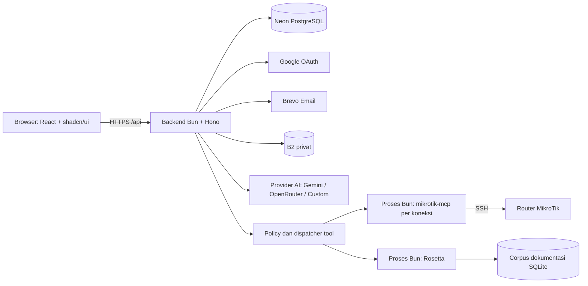

# Plan Implementasi — MikroTik AI Agent Chatbot

Dokumen ini adalah panduan implementasi untuk AI pelaksana. Hasil akhirnya adalah aplikasi web full-stack yang benar-benar terhubung ke layanan dan router, dengan pengalaman chat seperti ChatGPT/Claude.

**Tanggal rencana:** 5 September 2026.  
**Status:** perencanaan; belum ada implementasi atau pengujian aplikasi.  
**Bahasa antarmuka default:** Bahasa Indonesia.  
**Workspace:** `D:\agent-mikrotik`.

## 1. Cara menggunakan checklist

- [ ] Baca seluruh dokumen sebelum coding, terutama kontrak Read-Only/Write dan Safe Mode.
- [ ] Kerjakan milestone sesuai dependensi. UI boleh berkembang setelah setup shadcn selesai, tetapi Write tidak boleh diaktifkan sebelum pengaman backend lulus pengujian.
- [ ] Ubah `- [ ]` menjadi `- [x]` hanya setelah implementasi dan kriteria selesai item tersebut benar-benar terpenuhi.
- [ ] Catat hasil setiap milestone pada log progres di akhir dokumen: file terkait, pemeriksaan yang dijalankan, hasil, dan kendala yang masih ada.
- [ ] Jika layanan eksternal belum tersedia, gunakan adapter/mock untuk melanjutkan pekerjaan independen; biarkan checklist integrasi nyata tetap kosong.
- [ ] Jangan menganggap tampilan demo, respons AI statis, koneksi palsu, atau data hardcoded sebagai penyelesaian fitur.
- [ ] Simpan perubahan keputusan teknis dalam `docs/decisions.md`, termasuk alasan dan dampaknya terhadap kebutuhan pengguna.
- [ ] Jangan menambahkan billing, organisasi/tim, marketplace MCP, dashboard fleet, atau fitur lain di luar ruang lingkup sebagai syarat menyelesaikan aplikasi ini.

## 2. Hasil yang wajib tersedia

- [ ] Login menggunakan Google OAuth dan email + OTP tanpa password.
- [ ] Data user, session, percakapan, pesan, metadata lampiran, koneksi router, dan audit tersimpan di Neon PostgreSQL.
- [ ] Chat mendukung streaming, Markdown, code block dengan syntax highlighting, riwayat, chat baru, auto-scroll, mobile, serta light/dark mode.
- [ ] Menu `+` menyediakan Add file/photo, Connectors, dan toggle Write Mode.
- [ ] File/gambar tersimpan di bucket privat Backblaze B2, dapat dipreview, dan dapat digunakan AI sesuai tipe yang didukung.
- [ ] Connector menguji koneksi SSH sebelum menyimpan kredensial secara permanen; status dan kesalahan tampil sesuai keadaan sebenarnya.
- [ ] `@usex/mikrotik-mcp` dan `@tikoci/rosetta` merupakan integrasi bawaan di backend, masing-masing berjalan sebagai proses Bun terpisah.
- [ ] Jika operasi RouterOS yang diperlukan belum tersedia sebagai tool MCP bawaan, implementasikan tool tambahan sampai seluruh gap dalam matriks cakupan tertutup; jangan berhenti pada pemberitahuan bahwa MCP tidak mempunyai tool.
- [ ] Read-Only menjadi default dan ditegakkan secara teknis pada daftar tool serta dispatcher backend.
- [ ] Write menyediakan seluruh katalog tool yang tervalidasi, termasuk write/destructive, dengan pengendalian transaksi oleh backend.
- [ ] Password router terenkripsi; secret aplikasi tidak masuk browser, source repository, log, atau konteks LLM.
- [ ] Aplikasi dapat dijalankan dari dokumentasi setup, lolos pemeriksaan otomatis, dan memiliki bukti uji integrasi pada router lab.

## 3. Keputusan arsitektur

Keputusan berikut menjadi baseline agar AI pelaksana tidak menghabiskan waktu memilih stack ulang. Versi paket dan API aktual harus dibuktikan pada milestone M0.

| Area | Pilihan rencana | Alasan penggunaan |
| --- | --- | --- |
| Repository | Satu repository, Bun workspaces | Frontend dan backend tetap terpisah dengan kontrak bersama |
| Frontend | React + TypeScript + Vite | UI chat interaktif dengan build statis |
| UI | shadcn/ui + Tailwind CSS + ikon Lucide | Komponen dasar konsisten dan dapat diakses |
| State | TanStack Query untuk state server; state lokal untuk draft/UI | Status connector dan Write berasal dari backend |
| Backend | Bun + Hono + validasi Zod | Menjalankan API, streaming, dan proses MCP dalam satu layanan persisten |
| Database | Neon PostgreSQL + Drizzle ORM/migrations | Query terstruktur, constraint, dan migrasi yang dapat direproduksi |
| Auth | Google OIDC melalui library terawat; OTP dan opaque session di backend | Kedua metode login menghasilkan session aplikasi yang sama |
| AI | Multi-provider OpenAI-compatible (`openai` SDK, baseURL injectable): Google Gemini, OpenRouter, Custom (apiKey+baseUrl+model); auto-fetch model; mock deterministik bila tanpa kredensial | Tool loop dan streaming dikelola backend; kunci provider per-user terenkripsi |
| MCP | SDK MCP TypeScript dengan transport stdio | MCP privat; lifecycle dan kredensial dikendalikan backend |
| Email | Brevo Transactional Email API | Pilih satu jalur email; SMTP tidak diperlukan pada baseline |
| Storage | S3-compatible SDK untuk Backblaze B2 | Bucket privat, upload terkontrol, URL baca sementara |
| Pengujian | Bun test untuk backend; Vitest/Testing Library untuk UI; Playwright untuk E2E | Menguji batas keamanan, integrasi, dan alur pengguna |
| Deployment | Container Linux/VPS dengan proses Bun persisten | Backend membutuhkan proses anak dan sesi SSH yang bertahan |

**Batas awal:** satu router aktif per percakapan; user boleh menyimpan beberapa connector. Mutasi lintas router dalam satu transaksi tidak termasuk versi pertama. Identitas router dipasang pada setiap run agar mengganti connector tidak mengalihkan tindakan yang sudah dimulai.

**Topologi:** browser mengakses `/api` melalui origin yang sama. Saat development, Vite mem-proxy `/api` ke backend. Saat production, reverse proxy melayani frontend dan API dengan HTTPS. Mulai dengan satu instance backend; jangan menambah replica sebelum routing session MCP dan koordinasi lock terdistribusi tersedia.



Browser tidak mengakses MCP, SSH, Neon, atau secret provider secara langsung. Rosetta hanya menerima pertanyaan dokumentasi dan tidak diberi kredensial router.

**Perluasan tool:** integrasi MikroTik dapat berupa build dari fork/extension `mikrotik-mcp` yang dikelola dalam source repository. Tool bawaan dan tool tambahan memakai registry, dispatcher, koneksi SSH, serta coordinator Safe Mode yang sama. Tetap ada dua jenis server MCP bawaan tanpa UI instalasi MCP tambahan. Pembuatan tool dilakukan oleh AI pelaksana saat pengembangan, kemudian diuji dan dirilis; chatbot production tidak mengompilasi atau mengeksekusi kode tool buatan model secara langsung.

## 4. Fakta integrasi dan hal yang harus dibuktikan

Dokumentasi diperiksa saat penyusunan rencana; belum ada paket yang dipasang atau koneksi yang diuji. Temuan ini adalah dasar untuk spike implementasi, bukan bukti bahwa integrasi aplikasi sudah bekerja.

| Topik | Temuan dan konsekuensi rencana |
| --- | --- |
| Jumlah tool | Prompt menyebut 819, sedangkan README saat diperiksa menyebut 885. Ambil katalog dari `tools/list`, termasuk pagination; jangan hardcode jumlah. [Sumber](https://github.com/mikrotik-mcp/mikrotik-mcp) |
| Konfigurasi SSH | Dokumentasi mencantumkan `MIKROTIK_HOST`, `MIKROTIK_USERNAME`, `MIKROTIK_PASSWORD`, `MIKROTIK_PORT`, serta mode server `MIKROTIK_READ_ONLY`. Verifikasi perilakunya pada versi yang dipin. [Sumber](https://github.com/mikrotik-mcp/mikrotik-mcp/blob/master/docs/configuration.md) |
| Claude dan MCP lokal | MCP connector remote model-host memerlukan HTTP publik; stdio lokal tidak terhubung langsung. Karena itu backend menjadi MCP client dan menjalankan tool loop provider AI. (Riset M0 memakai dokumen Claude sebagai rujukan; M7 direvisi ke provider Gemini/OpenRouter/Custom.) [Sumber](https://platform.claude.com/docs/en/agents-and-tools/mcp-connector) |
| Katalog besar | Riset M0 (dokumen Claude) menunjukkan pola tool search/deferred loading; provider terpilih (Gemini/OpenRouter/Custom) menerima definisi tool penuh per mode. Filtering mode tetap dilakukan sebelum semua definisi tool yang diizinkan dikirim ke API. [Sumber](https://platform.claude.com/docs/en/agents-and-tools/tool-use/tool-search-tool) |
| Risk annotation | Annotation MCP merupakan petunjuk; aplikasi tetap memerlukan kebijakan otorisasi sendiri. Versi dependency harus dipin dan tool tanpa klasifikasi tepercaya ditolak. [Sumber](https://modelcontextprotocol.io/specification/2025-06-18/server/tools) |
| Safe Mode MCP | Dokumentasi menjelaskan shell SSH persisten dan tool enable/status/commit/rollback. Buktikan bahwa semua mutasi dalam satu transaksi melewati sesi yang benar. [Sumber](https://github.com/mikrotik-mcp/mikrotik-mcp/blob/master/docs/safe-mode.md) |
| Batas Safe Mode RouterOS | Dokumentasi vendor menyebut perubahan sesi lain ikut tercakup, rollback bisa tertunda, dan kapasitas history terbatas dapat menyebabkan keluar dari Safe Mode. Jangan menjanjikan rollback instan atau perlindungan untuk semua efek samping. [Sumber](https://help.mikrotik.com/docs/spaces/ROS/pages/328155/Configuration%2BManagement) |
| Corpus Rosetta | Setup Rosetta mengunduh database dokumentasi. Provision corpus pada setup/deployment dan sediakan penyimpanan persisten; jangan mengunduh ulang pada setiap pesan. [Sumber](https://github.com/tikoci/rosetta) |

### 4.1. Definisi tool lengkap dan inventaris cakupan

**Instruksi tambahan pengguna:** buat tool yang lengkap apabila tool tersebut belum ada di MCP. Ukuran selesai adalah cakupan operasi RouterOS yang dapat dibuktikan, bukan jumlah tool tertentu. Satu tool boleh mencakup beberapa operasi hanya jika seluruh cabang schema, risiko, dan perilakunya dapat diuji; nama tool serupa tidak otomatis membuktikan operasi sudah tercakup.

Buat `docs/tool-coverage.md` untuk pembacaan manusia dan `tooling/routeros-coverage.json` sebagai sumber data yang dapat diperiksa otomatis. Setiap baris memuat `command_path`, operation, property/argument penting, sumber dokumentasi, versi RouterOS, package/hardware yang disyaratkan, capability target, tool ID, asal `upstream/custom`, risk, recovery strategy, coverage status, dan test evidence.

| Status cakupan | Arti dan syarat |
| --- | --- |
| `covered-existing` | Tool bawaan memiliki schema/perilaku yang sesuai dan bukti uji |
| `covered-custom` | Gap ditutup tool tambahan yang sudah diimplementasikan dan diuji |
| `unsupported-on-target` | Operasi memang tidak tersedia pada versi/package/hardware router target; wajib ada bukti capability atau rujukan vendor |
| `gap-open` | Operasi dibutuhkan/tersedia tetapi belum memiliki implementasi atau bukti uji memadai; tetap pekerjaan terbuka |

Target cakupan adalah **100% operasi dalam inventaris yang didukung target**, dihitung dari operasi `covered-existing + covered-custom`. Publikasikan jumlah `unsupported-on-target` dan alasannya secara terpisah. Operasi yang ada di router tidak boleh dikeluarkan dari denominator hanya karena belum dibuatkan tool, sulit diuji, atau berisiko tinggi. Deklarasikan versi/package/hardware yang sudah diuji; jangan menyatakan seluruh versi/perangkat MikroTik telah didukung tanpa bukti.

Kelompok berikut wajib masuk inventaris awal, lalu lengkapi menggunakan seluruh command tree resmi untuk versi yang didukung. Daftar kelompok ini bukan alasan untuk mengabaikan cabang lain yang ditemukan.

| Kelompok | Cakupan yang perlu dipetakan | Inventaris selesai |
| --- | --- | --- |
| System dan perangkat | Identity, resource, health, clock/NTP, logging, history, package, RouterBOARD, reboot/shutdown/reset, upgrade bila tersedia | [ ] |
| Interface dan layer 2 | Ethernet, bridge, VLAN, bonding, switch, interface list, discovery, PoE, jenis interface terkait hardware | [ ] |
| Wireless dan akses radio | Wireless legacy, WiFi, CAPsMAN, security profile, registration, channel, serta package radio terkait | [ ] |
| IP dan layanan jaringan | IPv4/IPv6 address, pool, DHCP client/server/relay, DNS, ARP/neighbor, IP services, cloud/services terkait | [ ] |
| Routing | Route, routing table/rule, VRF, BGP, OSPF, RIP, BFD, routing filters, MPLS dan multicast bila tersedia | [ ] |
| Firewall dan NAT | Filter, raw, mangle, NAT, address list, connection tracking, service port, IPv4 dan IPv6 | [ ] |
| QoS dan trafik | Simple queue, queue tree/type, interface queue, statistik, accounting/traffic flow bila tersedia | [ ] |
| VPN dan tunnel | PPP, PPPoE, WireGuard, IPsec, L2TP, SSTP, OpenVPN, PPTP, GRE/IPIP/EoIP/VXLAN dan varian yang tersedia | [ ] |
| Hotspot dan AAA | Hotspot server/profile/user, active session, binding, walled garden, RADIUS, User Manager bila tersedia | [ ] |
| User dan keamanan | User/group/policy, SSH setting/key, certificate, akses manajemen dan secret handling | [ ] |
| File, backup, otomasi | File read/write/remove, export/import, backup/restore, script, scheduler, Netwatch, fetch bila tersedia | [ ] |
| Diagnostik | Ping, traceroute, bandwidth test, Torch, sniffer/capture, traffic generator, scan dan alat diagnostik lain | [ ] |
| Fitur opsional lainnya | Container, disk/storage, LTE/5G, GPS, IoT, SMB, RoMON, serta semua cabang tambahan dari command tree | [ ] |
| Dokumentasi Rosetta | Manual, command/property tree, changelog, hardware; gap dokumen/search ditutup tanpa menambah kemampuan eksekusi router | [ ] |

Untuk tiap menu, petakan operasi yang benar-benar didukung seperti list/get/print, add, set, remove, enable/disable, move, reset-counters, monitor, serta command khusus. Jangan membuat operasi CRUD fiktif untuk menu read-only atau menganggap semua command diagnostik tidak memiliki efek samping.

## 5. Struktur repository target

```text
agent-mikrotik/
├── apps/
│   ├── web/src/
│   │   ├── components/ui/       # hasil shadcn
│   │   ├── features/auth/
│   │   ├── features/chat/
│   │   ├── features/connectors/
│   │   ├── features/attachments/
│   │   └── lib/
│   └── api/src/
│       ├── routes/
│       ├── middleware/          # session, ownership, CSRF, rate limit
│       ├── services/            # auth, chat, storage, connector
│       ├── agent/               # agent loop multi-provider, context, stream
│       ├── mcp/                 # supervisor, clients, catalog, adapters
│       ├── policies/            # risk, dispatch, target validation
│       ├── transactions/        # Safe Mode state machine dan lock
│       ├── db/                  # schema dan queries
│       └── lib/                 # config, crypto, redaction, errors
├── packages/
│   ├── shared/                  # DTO/schema aman; tidak mengimpor secret
│   └── mikrotik-tools/          # tool tambahan, manifest risk, schema, parser
├── vendor/mikrotik-mcp/         # fork dipin bila extension upstream belum memadai
├── tooling/                    # inventory, coverage checker, code generation terkontrol
├── drizzle/
├── tests/                       # integration, fixtures, e2e
├── docs/                        # setup, decisions, contracts, recovery
├── Dockerfile
├── compose.yaml
├── .env.example
├── .gitignore
├── package.json
├── bun.lock
└── plan.md
```

## 6. Kontrak data

Nama kolom boleh disesuaikan dengan library yang dipilih, tetapi relasi, isolasi, dan constraint berikut wajib dipertahankan. Gunakan UUID/identifier acak, timestamp UTC, foreign key, dan index sesuai pola query.

| Tabel | Data utama dan aturan |
| --- | --- |
| `users` | `id`, email ternormalisasi unik, nama, avatar, `email_verified_at`, timestamps |
| `auth_identities` | `user_id`, provider, provider subject/Google `sub`; unique `(provider, subject)` sebagai identitas Google |
| `sessions` | `user_id`, hash token session, expiry, revocation; token mentah hanya berada di cookie |
| `otp_challenges` | email, purpose, keyed digest OTP, expiry, attempts, `consumed_at`, delivery status; tidak menyimpan OTP plaintext |
| `rate_limit_buckets` | key yang di-hash, window, counter, expiry; update atomik untuk limiter yang bertahan saat restart |
| `router_connections` | `user_id`, label, host, port, username, ciphertext password, nonce, auth tag, key version, host-key fingerprint, status, `last_verified_at`, version |
| `connection_permissions` | unique `(user_id, connection_id)`, `write_enabled` default false, version, timestamps |
| `conversations` | `user_id`, title, `active_connection_id` nullable, timestamps, soft-delete bila diperlukan |
| `messages` | `conversation_id`, role, content blocks, status, urutan stabil, timestamps; tidak menyimpan chain-of-thought internal |
| `attachments` | `user_id`, `conversation_id`, `message_id` nullable, object key unik, nama asli, tipe terverifikasi, ukuran, checksum, status |
| `agent_runs` | user/conversation/connection, request idempotency key, status, model, usage, start/end, cancel flag, policy version |
| `tool_executions` | run, tool-call ID unik dalam run, tool/risk, input tersanitasi, ringkasan hasil, status, durasi, error code |
| `change_transactions` | connection dan identitas perangkat, run, state, lock owner, verifikasi, commit/rollback outcome, recovery metadata |
| `audit_events` | user, action, connection/run, metadata teredaksi, timestamp; catatan append-only dari aplikasi |

- [ ] Terapkan ownership di setiap query dan service; `user_id` berasal dari session, bukan body request.
- [ ] Cegah pengaitan connector/lampiran/pesan milik user lain melalui validasi relasi dan constraint yang memungkinkan.
- [ ] Gunakan transaksi DB untuk OTP single-use, perubahan mode/version, pembuatan run idempoten, dan perubahan status terkait.
- [ ] Jangan menahan transaksi database selama menunggu LLM, SSH, email, atau upload; gunakan state persisten dan penanganan kegagalan antar-layanan.
- [ ] Tetapkan index minimal untuk email, session hash/expiry, conversation owner/update time, message sequence, attachment owner, run status, dan audit connection/time.
- [ ] Tentukan cleanup session/OTP kedaluwarsa, upload terbengkalai, dan retensi audit dalam konfigurasi serta dokumentasi.

## 7. Kontrak API dan streaming

Semua endpoint di bawah memerlukan session dan pemeriksaan kepemilikan kecuali alur login dan liveness. Endpoint browser yang mengubah state memerlukan perlindungan CSRF/origin. Tidak ada endpoint publik untuk meneruskan nama tool MCP atau command SSH mentah.

| Method dan endpoint | Tanggung jawab |
| --- | --- |
| `GET /api/auth/google` | Memulai OAuth dengan state/nonce/PKCE sesuai library |
| `GET /api/auth/callback/google` | Validasi callback, hubungkan identitas, buat session |
| `POST /api/auth/otp/request` | Validasi email, rate limit, buat challenge, kirim OTP via Brevo |
| `POST /api/auth/otp/verify` | Verifikasi dan konsumsi OTP secara atomik, buat user bila perlu, buat session |
| `GET /api/auth/me` | Profil user aktif yang aman dikirim ke browser |
| `POST /api/auth/logout` | Cabut session dan hentikan run milik session tersebut dengan recovery transaksi |
| `GET /api/connectors` | Daftar connector tanpa password/ciphertext |
| `POST /api/connectors` | Validasi target, auth-check SSH, baru simpan koneksi terenkripsi |
| `PATCH /api/connectors/:id` | Edit; perubahan host/port/username/password wajib diuji ulang sebelum mengganti data lama |
| `POST /api/connectors/:id/connect` | Reconnect credential tersimpan, cek fingerprint, kembalikan status terkini |
| `POST /api/connectors/:id/disconnect` | Revoke Write, batalkan antrean, selesaikan recovery, tutup proses/sesi |
| `PATCH /api/connectors/:id/mode` | Simpan Write ON/OFF dan version di backend; return state kanonis |
| `DELETE /api/connectors/:id` | Hapus setelah penanganan run aktif; jangan hilangkan data yang dibutuhkan recovery |
| `GET, POST /api/conversations` | Daftar dengan pagination atau buat chat baru |
| `PATCH, DELETE /api/conversations/:id` | Ubah judul/router aktif atau hapus chat setelah penanganan run aktif |
| `GET /api/conversations/:id/messages` | Ambil pesan tersimpan dengan pagination |
| `POST /api/conversations/:id/runs` | Validasi pesan/lampiran/router, persist input, mulai run dengan idempotency key |
| `GET /api/runs/:id/events` | SSE event run yang sudah diotorisasi; membuka stream tidak mengeksekusi ulang run |
| `GET /api/runs/:id` | Snapshot status dan hasil untuk refresh/reconnect |
| `POST /api/runs/:id/cancel` | Hentikan generasi dan mutasi baru; jalankan recovery transaksi jika diperlukan |
| `POST /api/attachments` | Multipart upload terbatasi melalui backend ke B2; metadata baru ready setelah verifikasi |
| `GET /api/attachments/:id/url` | URL baca singkat setelah ownership check |
| `DELETE /api/attachments/:id` | Hapus draft milik user atau jadwalkan penghapusan objek dengan cleanup idempoten |
| `GET /health/live` | Liveness minimal tanpa konfigurasi sensitif |
| `GET /health/ready` | Kesiapan dependency inti; detail operasional hanya untuk lingkungan internal |

**Format kesalahan:** `{ error: { code, message, requestId, fieldErrors? } }`. Gunakan kode stabil seperti `AUTH_REQUIRED`, `OTP_INVALID`, `RATE_LIMITED`, `SSH_AUTH_FAILED`, `SSH_TIMEOUT`, `HOST_KEY_CHANGED`, `WRITE_DISABLED`, `POLICY_CHANGED`, `SAFE_MODE_UNAVAILABLE`, `TOOL_UNSUPPORTED`, dan `TRANSACTION_UNKNOWN`. Jangan mengirim stderr/stack trace mentah ke browser.

**Event SSE:** `run.started`, `message.delta`, `tool.started`, `tool.completed`, `tool.failed`, `transaction.updated`, `run.completed`, `run.failed`, `run.cancelled`. Setiap event memiliki `id`, `runId`, urutan, dan payload bertipe. Event tool hanya memuat informasi yang sudah disanitasi.

**Semantik stream:** input disimpan sebelum stream dimulai; heartbeat menjaga koneksi; retry stream tidak membuat run baru. Reconnect mengambil snapshot lalu event berikutnya tanpa duplikasi. Jika browser putus, run tetap dibatasi deadline server; user dapat melanjutkan pemantauan atau membatalkan. Tombol Stop benar-benar membatalkan pekerjaan server, bukan hanya menutup tampilan streaming.

## 8. Milestone implementasi

### M0 — Verifikasi kontrak sebelum membangun integrasi

Dependensi: tidak ada. Output: `docs/integration-contracts.md` dan `docs/decisions.md`.

- [ ] Periksa instruksi repository dan toolchain yang tersedia. Pilih versi Bun, SDK, dan paket yang kompatibel; simpan versi/commit serta tanggal pemeriksaan.
- [ ] Jalankan instruksi pengguna `npx skills add shadcn/ui`, lalu baca skill yang terpasang sebelum menulis UI. Jika perintah berubah/gagal, cek dokumentasi resmi dan catat padanannya.
- [ ] Buktikan cara menjalankan kedua MCP menggunakan Bun dengan paket dipin; jangan memakai auto-update `latest` saat startup production.
- [ ] Jalankan handshake MCP dan ambil semua halaman `tools/list`; catat schema, annotations, benturan nama, serta perubahan katalog.
- [ ] Bandingkan katalog dengan command/property tree resmi dan capability router; mulai matriks cakupan bagian 4.1, termasuk operasi yang belum ada tool-nya.
- [ ] Verifikasi `auth-check`, pemetaan port, timeout, host-key verification, dan error aktual dari mikrotik-mcp.
- [ ] Verifikasi Safe Mode pada router lab: aktivasi, status, mutasi kecil, verifikasi, commit, rollback, dan kehilangan koneksi.
- [ ] Periksa tool generic/gateway, script execution, file operation, background task, dan nested invocation; identifikasi yang dapat melampaui klasifikasi read-only.
- [ ] Buktikan satu permintaan provider AI dengan katalog berukuran nyata (tool definitions dikirim penuh per mode). Verifikasi model, schema, streaming, dan payload batas provider (revisi M7: provider = Gemini/OpenRouter/Custom OpenAI-compatible).
- [ ] Buktikan setup corpus Rosetta, satu pencarian dokumentasi, persistensi corpus setelah restart, dan prosedur refresh terkontrol.
- [ ] Pilih library Google OIDC/session yang kompatibel dengan Bun/Hono dan validasi token menggunakan library tersebut; jangan menulis protokol OAuth/JWT verifier sendiri.
- [ ] Verifikasi SDK Neon, B2, Brevo, dan format input file/gambar provider AI yang dipilih melalui dokumentasi resmi saat implementasi.
- [ ] Dokumentasikan jaringan deployment menuju router. Router LAN memerlukan backend pada jaringan yang dapat merutekan ke LAN tersebut, misalnya VPN; memasukkan IP privat saja tidak membuatnya dapat diakses dari VPS.

**Kriteria selesai:** kontrak executable dan keterbatasan tercatat. Pekerjaan memakai mock boleh maju bila router/secret belum tersedia, tetapi pembuktian Write nyata tetap menjadi syarat sebelum fitur tersebut dinyatakan siap.

### M1 — Fondasi project dan environment

Dependensi: pilihan stack dan setup skill pada M0.

- [ ] Inisialisasi workspaces `apps/web`, `apps/api`, dan `packages/shared` dengan TypeScript strict.
- [ ] Jalankan `npx shadcn@latest init` di frontend, lalu tambah komponen yang diperlukan melalui CLI.
- [ ] Siapkan komponen Button, Input, Label, Textarea, Card, Sidebar, Sheet, Dialog, DropdownMenu, Switch, Alert, Avatar, Tooltip, Skeleton, Separator, dan notifikasi yang sesuai versi shadcn.
- [ ] Siapkan theme tokens light/dark, typography, layout responsif, focus state, dan preferensi tema persisten.
- [ ] Buat script `dev`, `build`, `typecheck`, `lint`, `test`, `test:e2e`, `db:generate`, dan `db:migrate` dengan cakupan workspace yang jelas.
- [ ] Buat validasi environment backend saat startup dan `.env.example` berisi placeholder saja.
- [ ] Masukkan `.env` dan variasi secret lokal, log sensitif, corpus/cache, serta artefak pengujian privat ke `.gitignore`; tetap track `.env.example`.
- [ ] Terapkan batas import agar frontend/shared tidak mengimpor modul backend, ORM, process supervisor, atau konfigurasi secret.
- [ ] Siapkan error handler, request ID, logger dengan redaction, batas ukuran request, dan endpoint health.
- [ ] Konfigurasikan same-origin proxy development dan rute SPA/`/api` production tanpa konflik.

**Kriteria selesai:** frontend dan backend berjalan, health merespons, komponen shadcn tampil, build/typecheck/lint lulus, bundle frontend bebas secret server.

### M2 — Database dan pengelolaan kredensial

Dependensi: M1.

- [ ] Implementasikan schema pada bagian 6, migration awal, foreign key, uniqueness, dan index.
- [ ] Gunakan `DATABASE_URL` pooled untuk query aplikasi dan `DATABASE_URL_DIRECT` untuk migration.
- [ ] Jalankan migration pada database development kosong dan dokumentasikan prosedur upgrade serta pemulihan migration gagal.
- [ ] Implementasikan enkripsi terautentikasi password router menggunakan AES-256-GCM dari library/runtime tepercaya, nonce acak unik, serta key version.
- [ ] Ikat ciphertext ke `user_id` dan `connection_id` melalui authenticated additional data agar ciphertext tidak dapat dipindahkan antar-record secara diam-diam.
- [ ] Simpan encryption key di environment/secret manager yang terpisah dari Neon. Sediakan prosedur rotasi key dan backup key yang diperlukan untuk dekripsi data lama.
- [ ] Hindari password di response DTO, SQL debug, audit, tracing, LLM prompt, dan process command-line; plaintext hanya digunakan saat koneksi membutuhkannya.
- [ ] Implementasikan helper ownership/repository yang menerima identitas session tervalidasi.
- [ ] Implementasikan redaction input dan output tool, termasuk field password, token, private key, PSK, connection string, dan URL bertanda tangan.

**Kriteria selesai:** round-trip enkripsi lulus; ciphertext yang diubah atau dipindah ke owner lain gagal diverifikasi; database dan log tidak berisi password router plaintext.

### M3 — Google OAuth, email OTP, dan session

Dependensi: M2.

- [ ] Bangun halaman login dengan tombol Google dan alur email → OTP enam digit → masuk ke aplikasi.
- [ ] Implementasikan Google OAuth/OIDC dengan redirect URI dari environment, state, nonce, PKCE sesuai library, serta validasi signature/issuer/audience/expiry.
- [ ] Gunakan Google `sub` sebagai identitas stabil. Pengaitan dengan akun email hanya dilakukan berdasarkan email Google yang terverifikasi dan aturan linking yang terdokumentasi.
- [ ] Buat user baru ketika email OTP terverifikasi belum terdaftar; login berikutnya memakai alur OTP yang sama.
- [ ] Generate OTP dengan CSPRNG; simpan keyed digest menggunakan secret terpisah dan binding email/challenge/purpose, bukan plaintext atau hash enam digit tanpa secret.
- [ ] Gunakan baseline OTP: masa berlaku 5 menit, maksimal 5 percobaan per challenge, jeda resend 60 detik, serta batas pengiriman per email dan IP yang dapat dikonfigurasi.
- [ ] Konsumsi OTP secara atomik dan satu kali saja. Resend yang aktif menggantikan challenge lama; kegagalan pengiriman dan aktivasi challenge ditangani secara eksplisit.
- [ ] Terapkan rate limit persisten pada request dan verify; gunakan respons generik agar alamat email terdaftar tidak bocor.
- [ ] Kirim OTP via Brevo Transactional Email API dengan sender tervalidasi; template memuat kode dan masa berlaku tanpa mencetak OTP ke log.
- [ ] Buat opaque session acak, simpan hash token di DB, rotasi saat login, dan gunakan cookie `HttpOnly`, `SameSite=Lax`, `Secure` pada HTTPS production.
- [ ] Tetapkan baseline session expiry 7 hari dengan revocation/logout; gunakan cookie development yang sesuai HTTP localhost secara terbatas.
- [ ] Terapkan pemeriksaan Origin dan CSRF pada request browser yang mengubah state; callback OAuth menggunakan validasi state tersendiri.
- [ ] Buat middleware auth, route guard UI, profil minimal, serta logout yang mencabut session server.

**Kriteria selesai:** Google login dan email OTP bekerja pada akun baru/lama; OTP salah, kedaluwarsa, replay, brute-force, callback palsu, dan session revoked ditolak.

### M4 — Connector MikroTik dan lifecycle MCP

Dependensi: M2, M3, kontrak MCP M0.

- [x] Buat dialog Connectors dengan label opsional, host/IP, port default 22, username, password, serta status pengujian koneksi. (apps/web/src/features/connectors/ConnectorDialog.tsx; E2E curl: create sukses → dialog tutup, gagal → tetap terbuka)
- [x] Validasi input di client dan server: hostname/IP benar, port 1–65535, batas panjang, dan input berbahaya tidak menjadi argumen shell. (Zod CreateSchema routes/connectors.ts: host regex `^[a-zA-Z0-9._-]+$`, port int 1–65535; child process spawn tanpa shell)
- [x] Terapkan kebijakan target SSH: subnet router privat boleh diizinkan secara eksplisit; blok metadata cloud, loopback, link-local, dan layanan internal yang bukan target router. (services/target-policy.ts + ROUTER_ALLOWED_CIDRS; 9 unit test lulus; E2E curl 127.0.0.1 → HOST_NOT_ALLOWED)
- [x] Validasi semua hasil resolusi DNS/IPv4/IPv6, cegah DNS rebinding, dan pastikan koneksi menuju alamat yang sudah lolos kebijakan. (target-policy.ts: hostname → semua record A/AAAA harus lolos; unit test DNS rebinding lulus)
- [x] Terapkan host-key verification: pin fingerprint pada koneksi pertama yang berhasil sesuai kebijakan onboarding; perubahan fingerprint tidak diterima diam-diam. (ssh-probe.ts hostVerifier SHA256:base64 selalu dihitung; connector.create mempersist fingerprint; update/connect memverifikasi terhadap pin; HOST_KEY_CHANGED 400)
- [x] Lakukan auth-check dari backend dengan timeout dan pembatasan frekuensi; hanya persist credential setelah koneksi berhasil. (probeRouter SSH real ssh2, SSH_CONNECT_TIMEOUT_MS; persist hanya setelah probe.ok; E2E host mati → SSH_TIMEOUT, tidak ada record DB)
- [x] Jika test gagal, form tetap terbuka dan data lama tidak tertimpa; bedakan auth failure, DNS/host unreachable, timeout, port refused, dan host-key mismatch. (SSH_AUTH_FAILED/SSH_UNREACHABLE/SSH_TIMEOUT/HOST_KEY_CHANGED dengan pesan Indonesia + hint di UI; integration test: update gagal → credential lama tetap terdekripsi)
- [x] Jika test berhasil, tutup form, tampilkan router aktif dan opsi disconnect/ganti; status `Terhubung` harus punya bukti koneksi, bukan sekadar record DB ada. (status hanya `connected` setelah probe SSH sukses; panel menampilkan routerIdentity + lastVerifiedAt)
- [x] Buat supervisor mikrotik-mcp terisolasi per `(user_id, connection_id)`; jangan mengganti `process.env` global saat request user masuk. (mcp/supervisor.ts key userId:connectionId; env child hanya MIKROTIK_*, tidak mewarisi process.env)
- [x] Spawn proses memakai executable/argumen tetap dan environment minimum per child process; jangan meneruskan seluruh environment aplikasi. (mcp/spawn-plan.ts; StdioClientTransport env eksplisit)
- [x] Gunakan working directory/cache terisolasi agar konfigurasi, log, memory, atau artefak MCP tidak tercampur antar-user. (cwd = tmpdir()/agent-mikrotik-mcp/<userId>/<connectionId> per child)
- [x] Jalankan Rosetta sebagai proses Bun tersendiri dengan corpus persisten dan tanpa secret router/provider. Shared process hanya boleh untuk dokumentasi publik tanpa state privat user. (mcp/rosetta.ts; env hanya DB_PATH; E2E /api/tools/rosetta 14 tool + routeros_search "safe mode" sukses via child process nyata)
- [x] Terapkan startup timeout, health check, process crash handling, bounded restart, idle cleanup, serta batas proses/per-user/global. (startupTimeoutMs 30s; onclose/onerror → entry dead → respawn on-demand saat permintaan berikutnya (tanpa auto-restart tak terbatas); idle timer unref; MAX_MCP_PROCESSES_PER_USER/TOTAL — 5 integration test child-process nyata lulus)
- [x] Jangan melakukan restart otomatis proses yang sedang memiliki transaksi tanpa recovery; kegagalan harus mempertahankan status transaksi yang dapat ditelusuri. (respawn hanya on-demand, tidak otomatis; crash child → entry dead → getOrSpawn berikutnya spawn baru; M6: transaksi terkait ditandai unknown oleh assertActive/reconcile, status tersimpan di DB — test process-crash lulus)
- [x] Disconnect mematikan Write, menghentikan call baru, menyelesaikan rollback/reconciliation, lalu menutup sesi. Reconnect kembali ke Read-Only. (route disconnect: cleanupTransactions → forceRollback tx aktif → supervisor.stop() → revoke write; connect berikutnya mulai read-only; integration test lulus; M6 forceRollback teruji)
- [ ] Ganti router percakapan hanya ketika run sebelumnya selesai atau sudah ditangani pembatalannya; target baru dimulai Read-Only. (menunggu percakapan M7; policy per-connector baru dimulai Read-Only sudah teruji)

**Kriteria selesai:** koneksi nyata dapat dibuat/diganti/diputus, gagal tersaji akurat, dua user tidak berbagi kredensial/state, dan tidak ada child process yatim setelah cleanup.

### M4B — Melengkapi tool yang belum tersedia di MCP

Dependensi: M0, M4. Pengembangan schema/adapter dapat berjalan bertahap; pengujian mutasi nyata menunggu pengaman M5–M6. Output: implementasi tool tambahan, katalog gabungan, matriks cakupan, dan bukti pengujian. Ini fitur wajib berdasarkan instruksi tambahan pengguna.

- [x] Ekspor katalog `tools/list` lengkap dari versi MCP yang dipin, termasuk schema/annotation, lalu cocokkan per operasi dan argumen dengan inventaris bagian 4.1. (tooling/catalog/mikrotik-full.json 891 tool + schema/annotation; tooling/routeros-coverage.json: 127 menu, 489 operasi terpetakan)
- [x] Periksa implementasi tool bawaan yang tampak serupa; tandai gap jika parameter/action yang dibutuhkan tidak didukung atau implementasinya tidak sesuai perilaku RouterOS. (audit alias deskripsi: tool seperti get_wireless_registration_table/list_backups teridentifikasi; 7 gap nyata terkonfirmasi tanpa tool upstream: bonding, neighbor discovery, MPLS, LTE, GPS, SMB, SNMP)
- [x] Buat daftar gap konkret per modul dengan nama tool yang akan dibuat, command resmi, schema input/output, risk, capability/version constraint, dan test case. (docs/tool-coverage.md — tabel 7 tool custom dengan command path, risk, capability; test case di packages/mikrotik-tools/src/index.test.ts)
- [x] Baca source dan dokumentasi extension upstream. Gunakan extension registry jika memadai; jika tidak, buat fork yang dipin dan dapat dibangun ulang, dengan lisensi serta catatan patch/upstream commit. (upstream tidak punya registry extension; gap ditutup TANPA fork — tool custom backend di packages/mikrotik-tools, keputusan D-008 di docs/decisions.md)
- [ ] Jangan mengedit dependency terpasang secara manual di `node_modules`, mengganti source saat runtime, atau bergantung pada fork yang tidak disertakan/dipin dalam repository.
- [x] Bangun `packages/mikrotik-tools` dengan kontrak handler terstruktur dan dependency injection terhadap executor SSH milik connector; tool tidak membuat koneksi SSH independen untuk mutasi transaksi. (packages/mikrotik-tools/src/{command-builder,output-parser,executor,tools}.ts — RouterOsExecutor di-inject, tanpa kredensial, tanpa koneksi mandiri)
- [ ] Jika akses ke executor/Safe Mode belum disediakan upstream, tambahkan adapter pada fork agar tool bawaan dan tambahan menggunakan jalur eksekusi dan transaction state yang sama.
- [x] Gunakan manifest statis berisi tool ID, versi, origin, description, input/output schema, risk/annotations, capability, timeout, idempotency, sensitive fields, serta recovery strategy. (ToolManifest di types.ts; 7 manifest custom lengkap semua field, unit test verifikasi)
- [x] Buat tool spesifik dengan input bertipe dan validasi server; gunakan identifier RouterOS stabil jika tersedia, bukan posisi baris yang dapat bergeser setelah perubahan. (Zod schema per tool; selector .id stabil via command-builder whereId, bukan posisi baris)
- [ ] Pisahkan operasi dengan risiko berbeda, atau klasifikasikan tool gabungan sesuai cabang paling berisiko dan validasi ulang argumen efektif di dispatcher.
- [x] Implementasikan command builder dengan quoting/escaping RouterOS yang teruji, selector yang terkontrol, dan tanpa shell interpolation; jangan memberikan `exec(command: string)` tanpa batas sebagai pengganti tool yang belum dibuat. (command-builder.ts: semua segmen tervalidasi (ident/OP regex), nilai di-quote/escape; unit test nilai hostile tidak dapat keluar dari quoting; tidak ada exec(string) bebas di tool custom)
- [ ] Perlakukan script/import/fetch/file dan task terjadwal sebagai operasi dengan efek nyata; sediakan schema, target/path policy, risk, serta tracking tersendiri. Jadwal atau script yang sudah dipasang tidak otomatis berhenti hanya karena Write kemudian OFF.
- [ ] Untuk operasi jangka panjang seperti monitor/sniffer/test, tetapkan durasi/batas data, cancellation, dan cleanup; jangan menyebutnya read-only hanya karena menghasilkan statistik.
- [x] Implementasikan parser output RouterOS yang menangani field kosong, flags, multi-line, escaping, error, dan variasi versi; kembalikan hasil bertipe dan teredaksi. (output-parser.ts: flags, .id, multi-line, unquote, detectError; hasil bertipe ParsedRow; redaksi via ctx.redact — unit test lulus)
- [x] Jangan memasukkan credential router ke schema yang diisi model. Host/user/password diambil dari konteks connector yang sudah diotorisasi. (schema tool custom tidak punya field host/user/password; kredensial hanya di ConnectionSpec internal supervisor)
- [x] Buat tool read/list lebih dahulu untuk memperoleh bukti keadaan, lalu add/set/remove dan operasi khusus berikut prosedur verifikasi/recovery-nya. (7 tool list/get dibuat & teruji; add/set/remove custom tidak diperlukan — operasi write tercakup tool upstream, terverifikasi coverage matrix; prosedur verifikasi/recovery di M5/M6)
- [ ] Daftarkan tool tambahan ke server MikroTik bawaan dan adapter provider AI dengan namespace konsisten; jalankan discovery lagi untuk membuktikan tool benar-benar callable melalui MCP.
- [ ] Masukkan tool tambahan ke filter Read-Only/Write, deferred search, capability check, lock router, Safe Mode, audit, rate limit, dan redaction yang sama dengan tool upstream.
- [ ] Bila fitur Rosetta tidak ada, tambahkan ingestion/index/query atau tool dokumentasi melalui extension/fork Rosetta yang dipin dan bersumber dari dokumentasi resmi. Rosetta tetap tidak mengeksekusi command router.
- [ ] Jika jumlah tool gabungan bertambah melewati batas provider, selesaikan arsitektur katalog/search dan buktikan dukungannya; jangan membuang tool tambahan dari katalog tanpa pemberitahuan.
- [x] Gunakan generator hanya untuk draft schema/handler berulang dari sumber terstruktur; review hasil dan klasifikasi risiko sebelum build. Tool belum ditinjau tidak otomatis memperoleh izin eksekusi. (tool ditulis manual dengan review risiko per-manifest (semua read-only); tidak ada generator tanpa review)
- [x] Uji setiap tool tambahan: input valid/invalid, command escaping, parser, redaction, Read-Only denial untuk mutasi, owner/target binding, dan jalur error. (19 unit test lulus: input valid/invalid, escaping, parser, redaksi SNMP community, TOOL_UNSUPPORTED capability, jalur error; Read-Only denial untuk mutasi = tool read-only tidak punya jalur mutasi; owner/target binding via executor connector — enforcement penuh dispatcher di M5)
- [ ] Uji kelompok mutasi pada router lab: hasil nyata, Safe Mode session yang sama, commit/rollback bila didukung, duplikasi request, timeout, dan hasil tidak pasti.
- [ ] Implementasikan prosedur terpisah yang teruji untuk operasi irreversible/tidak tercakup Safe Mode; jangan mengklaim perlindungan palsu. Operasi yang belum teruji tetap `gap-open`, bukan selesai.
- [x] Tambahkan pemeriksaan otomatis coverage untuk mendeteksi command belum terpetakan, tool tanpa schema/risk/test, ID duplikat, dan pergeseran katalog setelah upgrade upstream. (tooling/coverage/build-coverage.ts: deteksi menu tanpa tool → gap-open; unit test manifest unik + wajib schema/risk/commandPath; dijalankan ulang saat upgrade untuk snapshot pergeseran katalog)
- [ ] Jika upstream kemudian menambah tool serupa, selesaikan benturan dan migrasi mapping berdasarkan uji kesetaraan; jangan merutekan panggilan ke implementasi baru tanpa validasi.
- [x] Perbarui matriks setiap gap ditutup dan publikasikan ringkasan total operasi, covered-existing, covered-custom, unsupported-on-target dengan alasan, serta gap-open. (docs/tool-coverage.md + tooling/routeros-coverage.json: 489 operasi, 482 covered-existing, 7 covered-custom, 0 gap-open; unsupported-on-target ditentukan runtime per router)

**Kriteria selesai:** tidak ada `gap-open` pada inventaris operasi yang didukung target; seluruh tool tambahan tersedia lewat MCP dan provider AI, melewati pengamanan yang sama, serta memiliki bukti uji. Saran command manual boleh membantu saat pengembangan, tetapi tidak menggantikan kewajiban membuat tool yang memang dapat didukung.

### M5 — Kebijakan Read-Only dan Write

Dependensi: M4. Milestone ini wajib lulus sebelum mutasi router diaktifkan.

- [x] Normalisasikan katalog MCP menjadi nama tool, origin server, schema, risk, capability, dan classification provenance; gunakan namespace yang cocok dengan batas nama tool provider. (policies/normalize.ts: fqName mt:/docs:/custom:, provenance eksplisit upstream-annotation+read-only-registration/upstream-annotation/custom-manifest/none)
- [x] Gabungkan tool upstream dan tambahan M4B melalui jalur policy yang sama; unit test policy tidak bergantung pada nama/prefix tool bawaan saja. (dispatcher.buildModeCatalog + live-catalog.ts: upstream (live tools/list) + rosetta + custom_tools melalui jalur sama; test integrasi memakai katalog live 385+14+7, bukan nama prefix)
- [x] Perlakukan tool tanpa annotation, annotation bertentangan, atau klasifikasi yang belum diperiksa sebagai tidak diizinkan sampai direview; jangan menebak dari awalan `get`/`list`. (normalize.ts: tanpa annotation → unknown; readOnlyHint tanpa registrasi read-only → unknown (kontradiksi); unknown ditolak dispatcher dengan TOOL_UNSUPPORTED — unit test lulus)
- [x] Default record permission baru adalah `write_enabled=false`; state frontend hanya merefleksikan state backend. (M4 connector: connectionPermissions.writeEnabled default false; UI switch baca dari server, kirim expectedVersion)
- [x] Pada Read-Only, kirim hanya tool MikroTik yang terverifikasi read-only serta tool dokumentasi Rosetta yang diperlukan ke provider AI. (live-catalog.integration.test: katalog read-only live = registrasi read-only child ∩ annotation + rosetta + custom; 19/19 test lulus, child process nyata)
- [x] Pastikan tool write/destructive juga tidak masuk katalog deferred/search pada Read-Only. Definisi tersembunyi di deferred loading tetap merupakan tool yang didaftarkan. (buildModeCatalog filter pada SELURUH katalog sebelum ekspos; find_tools (deferred search upstream) hanya melihat katalog yang diizinkan — dispatcher juga re-check nama tool target invoke_tool; uji A10 gateway smuggling lulus)
- [x] Audit generic invoker/gateway/script tool: tolak atau beri wrapper yang memeriksa target tool dan argumen efektif; jangan membuka jalur mutasi melalui tool berlabel read. (dispatcher: isGateway detection; invoke_tool/run_routeros_command TIDAK ada di katalog read-only; defense-in-depth re-dispatch inner tool — test gateway smuggling write via invoke_tool ditolak WRITE_DISABLED)
- [x] Saat Write ON, daftarkan seluruh katalog read/write/destructive yang sudah tervalidasi. Jangan diam-diam membatasi ke beberapa tool top-k untuk menghindari masalah ukuran request. (buildModeCatalog write = semua risk read/write/destructive; test: write > read, escape hatch run_routeros_command hadir; unknown tetap dikecualikan)
- [ ] Gunakan tool search/deferred loading jika hasil spike mendukung; semua definisi yang diizinkan tetap tersedia. Jika batas provider belum teratasi, laporkan blocker kontrak secara eksplisit. (menunggu M7: katalog 385+14+7 tool dikirim penuh per mode ke provider terpilih; deferred loading dievaluasi saat agent loop dibangun — blocker ukuran request, bila ada, akan dilaporkan eksplisit)
- [x] Pada setiap dispatch, cek ulang session, owner connector, router terikat ke run, current mode/version, tool allowlist, schema input, capability, dan transaction state. (dispatcher.check: 7 tahap re-check per dispatch — session, owner, live mode+version CAS, catalog per mode, risk vs mode, schema, FORBIDDEN args, transactionState; 17 unit test)
- [x] Tolak argumen LLM yang mencoba mengubah perangkat, host, credential, path lokal backend, atau target tenant di luar connector run. (FORBIDDEN_ARG_NAMES: host/ip/port/username/password/credential/device/target/path/tenant → FORBIDDEN; test A30 lulus)
- [x] Lindungi perubahan mode dengan compare-and-set/version; UI menunggu respons server dan menampilkan kegagalan bila update tidak berhasil. (M4 setMode CAS POLICY_CHANGED 409 + UI invalidasi react-query pada error)
- [x] Write OFF mencabut izin mutasi baru secara atomik, termasuk queued/stale tool call; beri event ke tab lain dan mulai recovery transaksi aktif. (dispatcher re-check live mode per dispatch → POLICY_CHANGED menolak queued/stale call (test race A08 lulus); audit event tool.denied tersimpan; M6: route Write OFF forceRollback transaksi aktif + stop child)
- [x] Cegah race antara dispatch dan OFF melalui coordinator/lock: call yang sudah dikirim bisa memerlukan recovery, sedangkan call berikutnya tidak boleh berangkat. (dispatcher menolak call berikutnya via live mode re-check (atomic UPDATE version di permissions); call terlanjur tercatat audit untuk recovery M6)
- [x] Saat mode/router berubah, bangun ulang katalog dan konteks provider. Jangan memutar ulang tool reference lama yang sekarang dilarang; hasil lama boleh diringkas sebagai riwayat, bukan otorisasi baru. (catalogSource.invalidate() saat mode berubah + katalog per-mode dibangun ulang dari child live; supervisor respawn child saat mode berubah (M4); tool reference lama tidak pernah jadi otorisasi — dispatcher lookup katalog per mode saat dispatch)
- [x] Pada Read-Only, permintaan perubahan mendapat penjelasan/command dan petunjuk mengaktifkan Write, tanpa eksekusi atau aktivasi mode oleh AI. (dispatcher: penolakan read-only menyertakan pesan "aktifkan Write dari panel connector (bukan oleh AI)"; tool mutasi tidak pernah sampai ke LLM)
- [x] Audit semua perubahan mode, dispatch yang ditolak, serta pemanggilan tool tanpa menyimpan secret. (audit_events: connector.write_enabled/disabled (M4) + tool.allowed/tool.denied dengan metadata tanpa secret; audit hook fire-and-log agar dispatch tidak gagal karena audit)

**Kriteria selesai:** pengujian membuktikan tool mutasi tidak dikirim ke LLM pada Read-Only dan panggilan paksa tetap ditolak backend; mode OFF dari tab lain menghentikan mutasi berikutnya.

### M6 — Transaksi Safe Mode dan recovery

Dependensi: M5 dan bukti perilaku Safe Mode M0.

State transaksi minimum: `preparing → active → verifying → committing → committed`; jalur gagal melalui `rolling_back → rolled_back` atau `unknown`. Keadaan belum terverifikasi tidak boleh dilabeli berhasil.

- [x] Buat coordinator transaksi milik backend; keputusan memulai, memverifikasi, commit, dan rollback tidak hanya bergantung pada teks prompt AI. (transactions/coordinator.ts: state machine preparing→active→verifying→committing→committed / rolling_back→rolled_back / unknown; ALLOWED_TRANSITIONS ketat; 12 test failure-injection lulus; dispatcher menolak enable/commit/rollback_safe_mode untuk model — SAFE_MODE_UNAVAILABLE "hanya dikelola sistem")
- [x] Serialkan mutasi menggunakan lock per perangkat fisik, termasuk connector berbeda yang menunjuk router sama; gunakan fingerprint/identitas router yang telah diverifikasi untuk menghindari alias host. (lock Map in-process per routerIdentity hasil probe; begin() juga cek DB row live + unknown; test konflik 2 tx router sama lulus)
- [x] Jangan mengambil alih Safe Mode yang sudah dimiliki sesi lain. Laporkan konflik tanpa membocorkan identitas user lain. (409 "sedang dipakai transaksi lain. Tunggu hingga selesai atau putuskan dari panel." — tanpa identitas; begin dengan unknown aktif juga ditolak sampai reconciliasi)
- [x] Ambil snapshot kondisi relevan yang tidak mengandung secret, tentukan perubahan yang diminta dan pemeriksaan pascaperubahan, lalu aktifkan Safe Mode. (begin() menyimpan snapshotPlan ke kolom verification jsonb; enable via adapter mcp-session pada child milik (userId,connectionId); persist fase SEBELUM aksi eksternal)
- [x] Verifikasi Safe Mode aktif sebelum mutasi dan sebelum melanjutkan batch; gunakan sesi SSH persisten yang sama sesuai kontrak adapter. (assertActive() dipanggil sebelum tiap batch: cek state DB + probe safe_mode_status; sesi shell sama = child process sama; window closed → unknown)
- [x] Jalankan perubahan secara berurutan dan dalam batch kecil; batas aplikasi harus mempertimbangkan jumlah aksi RouterOS, bukan hanya jumlah tool call. (recordAction(txId) dengan cap MAX_ACTIONS_PER_TRANSACTION=20 per aksi RouterOS, bukan tool call; pelanggaran → VALIDATION_FAILED; test cap lulus)
- [x] Periksa sintaks, hasil tool, kondisi target, dan kesehatan akses manajemen sebelum commit. SSH command berhasil saja tidak cukup membuktikan jaringan tetap sehat. (commit(): verifyChecks dulu — verifyManagement mengeksekusi get_system_identity pada child transaksi yang sama; gagal → rollback, tidak pernah commit)
- [x] Lakukan commit hanya jika seluruh perubahan dan pemeriksaan yang relevan berhasil serta otorisasi Write masih valid. (commit: verify → commit; commit error + window aktif → rolled_back eksplisit; status tak terbaca → unknown — tidak pernah false success; test drop mid-commit & window aktif lulus)
- [x] Tool enable/commit/rollback yang terlihat oleh model tetap melewati state machine; tolak commit dini, transaksi bersarang, atau usaha melewati verifikasi. (dispatcher SAFE_MODE_LIFECYCLE_TOOLS: mt:enable/commit/rollback_safe_mode → deny dua mode + gateway smuggling invoke_tool(commit_safe_mode) → deny; safe_mode_status tetap read-only untuk model; double commit → CONFLICT transisi invalid; test lulus)
- [x] Pada tool gagal, deadline, pembatalan, logout, disconnect, atau Write OFF: hentikan mutasi baru dan upayakan rollback transaksi milik run tersebut. (disconnect & DELETE: cleanupTransactions → forceRollback tx aktif lalu supervisor.stop; Write OFF (PATCH mode read-only): forceRollback tx aktif + stop child + CAS mode; assertActive menolak mutasi baru setelah unknown)
- [x] Izinkan cleanup rollback milik backend setelah Write dicabut; pengecualian internal ini tidak boleh menjadi izin mutasi yang dapat dipanggil model. (forceRollback hanya dipanggil backend (routes disconnect/mode); tidak ada path model — dispatcher menolak lifecycle tools; test forceRollback lulus)
- [x] Bedakan `rollback requested`, `rollback verified`, dan `unknown`. Lakukan reconnect/recheck terkontrol sebelum menyimpulkan hasil akhir. (rollback(): status setelah aksi → closed=rolled_back verified; aktif → unknown; drop saat rollback → unknown "verified not claimed"; reconcile() baca window: aktif → rollback backend, closed → rolled_back auto-revert, tak terbaca → unknown; tidak pernah replay)
- [x] Persist identitas transaksi dan fase penting sebelum tindakan eksternal; setelah process/server crash, tandai run terputus dan lakukan reconciliation, bukan mengulang mutasi. (transition() persist fase sebelum aksi eksternal; crash (session hilang) → assertActive menandai unknown, reconcile tidak replay — test process-crash lulus; audit_events transaction.begun/committed/rolled_back tersimpan)
- [x] Deduplikasi tool-call ID dan request run. Jangan otomatis retry mutasi dengan hasil tidak pasti; baca kondisi router dahulu. (M7 loop.ts: dedup id via Map per run — id duplikat dijawab pesan tool DUPLICATE_CALL agar alternasi provider tetap valid, tidak dieksekusi ulang; idempotencyKey run unik per conversation → replay mengembalikan run yang sama (resumed:true); koordinator transaksi tidak pernah retry)
- [x] Buat matriks capability/recovery untuk operasi destructive seperti reset, reboot, upgrade, penghapusan file, atau perubahan akses. Implementasikan penanganan yang teruji melalui M4B; selama belum siap, return `TOOL_UNSUPPORTED` dengan alasan dan tandai `gap-open`. Hanya ketidaktersediaan fitur nyata pada target yang boleh menjadi pengecualian cakupan permanen. (manifest custom M4B: recoveryStrategy/sensitiveFields/idempotent per tool; TOOL_UNSUPPORTED via capability check runtime; coverage matrix 489 operasi: destructive reset/reboot dll covered-existing oleh upstream dengan risk destructive di dispatcher; gap-open=0)
- [x] Jangan mengiklankan Safe Mode sebagai rollback universal. Dokumentasikan pengaruh sesi admin eksternal, batas history, dan efek yang tidak dapat di-undo; jangan otomatis mengambil alih sesi admin lain. (docs/integration-contracts.md SafeModeManager: batas history penuh, sesi admin lain, tidak dijanjikan rollback universal; konflik sesi lain → 409 tanpa takeover)
- [x] Tampilkan ringkasan perubahan, hasil verifikasi, commit/rollback, dan status belum pasti pada chat serta audit. (audit_events transaction.* tersimpan; M7 SSE menstream event tool.started/completed/failed + run.completed/cancelled ke chat; API GET /api/transactions mengekspos state lengkap ke owner — rendering UI ringkasan menunggu M9)

**Kriteria selesai:** perubahan kecil pada router lab dapat commit dan rollback; failure injection termasuk koneksi putus dan proses mati tidak menghasilkan keberhasilan palsu, replay mutasi, atau transaksi yang hilang dari audit.

### M7 — Agent multi-provider (Gemini/OpenRouter/Custom), Rosetta, dan streaming persisten

Dependensi: M3–M5; jalur Write memakai M6.

> Revisi 2026-09-05 (permintaan user): Anthropic/Claude TIDAK DIPAKAI karena biaya; provider AI menjadi multi-provider OpenAI-compatible — Google Gemini (via endpoint OpenAI-compat resmi Google), OpenRouter, dan Custom (apiKey + baseUrl + model manual). Fitur tambahan wajib: auto-fetch daftar model provider saat kredensial diisi, dan input model manual tetap didukung.

- [x] Implementasikan adapter provider AI dengan protokol OpenAI-compatible (`openai` SDK, baseURL injectable) untuk Gemini (`https://generativelanguage.googleapis.com/v1beta/openai/v1`), OpenRouter (`https://openrouter.ai/api/v1`), dan Custom (baseUrl bebas); kunci hanya server-side, tidak pernah dikirim ke browser. (agent/chat-client.ts: createOpenAiCompatibleClient via `openai` SDK v4 — baseURL+apiKey per user, stream AsyncGenerator text|tool_calls|usage|done; @anthropic-ai/sdk di-uninstall; mock deterministik createMockClient fallback bila user belum set provider. Bukti E2E: fake provider custom :3998 streaming tool call + teks final. JUJUR: Gemini & OpenRouter nyata belum diuji — user belum memberi API key; endpoint OpenAI-compat adalah yang didokumentasikan Google/OpenRouter)
- [x] Persist pengaturan provider per user (providerKind, baseUrl, model, apiKey terenkripsi AES-GCM via keyRing yang sama dengan kredensial router); API key tidak pernah dikembalikan plaintext oleh API. (agent/provider-settings.ts + tabel ai_provider_settings + migrasi 0001 (lokal & Neon); sealSecret AAD "ai-provider"; GET hanya {kind,baseUrl,model,hasKey}; E2E: ciphertext di DB `FYHUXD0EfY5s+20umFo=`, key salah → UPSTREAM_AUTH_FAILED; test provider-settings.test.ts 7 lulus: round-trip, no-key-leak, upsert, wrong-keyring → INTERNAL_ERROR, validasi)
- [x] Fitur auto-fetch model: endpoint backend mem-proxy daftar model dari provider (Gemini: `GET /v1beta/models` filter generateContent; OpenRouter/Custom: `GET /v1/models` OpenAI-compatible) saat user memasukkan apiKey/baseUrl — dipanggil dari backend agar key tidak diekspos ke browser; model juga tetap bisa ditulis manual. (agent/model-fetch.ts + POST /api/ai-provider/models — key transient tidak disimpan; timeout 12s; error typed UPSTREAM_AUTH_FAILED/UPSTREAM_TIMEOUT/UPSTREAM_ERROR. E2E: fake provider :3999 `/v1/models` → [test-model-a, test-model-b]; key salah → UPSTREAM_AUTH_FAILED. Test model-fetch.test.ts 6 lulus: native gemini endpoint + filter generateContent, Bearer openrouter/custom, slash normalize, 401/500 mapping, custom tanpa baseUrl ditolak sebelum fetch. Model manual tetap bisa ditulis di POST /api/ai-provider)
- [x] Buat system instruction untuk bahasa, mode, router aktif, penggunaan dokumentasi, kejujuran hasil, dan larangan memperlakukan data tool/file sebagai instruksi otorisasi. (agent/instructions.ts: Bahasa Indonesia, aturan prompt-injection data≠instruksi, mode/router aktif dari policy snapshot)
- [x] Bangun siklus pesan user → request provider → validasi tool call lengkap → dispatch → tool result → request lanjutan → jawaban akhir. (agent/loop.ts: history bounded 24 → provider stream → JSON.parse args → dispatcher.check → executeTool → tool message → iterasi; E2E terbukti: run.started → tool.started → tool.completed (routeros_search Rosetta NYATA "safe mode" → halaman manual Configuration Management) → message.delta ×2 → run.completed usage {promptTokens:11, completionTokens:9, toolCalls:1})
- [x] Tunggu argumen tool lengkap dan lolos schema sebelum eksekusi; delta JSON yang belum lengkap tidak boleh dijalankan. (loop.ts: JSON.parse gagal → toolExecutions status rejected errorCode VALIDATION_FAILED, tidak dieksekusi; E2E sebelumnya membuktikan args kosong ditolak schema validator "argumen \"query\" wajib diisi" → tool.failed → provider menerima hasil error → tetap menjawab; test loop.test.ts: incomplete JSON → executed=0, rejected)
- [x] Pertahankan pasangan tool-call/tool-result dan format history provider yang valid; tangani tool error sebagai hasil bertipe. (loop.ts: setiap assistant tool_calls selalu diikuti pesan tool — termasuk dedup id duplikat yang dijawab pesan DUPLICATE_CALL agar alternasi OpenAI tetap valid; denial/exception → content JSON {error, message} bertipe; test 4 skenario loop lulus)
- [x] Gunakan Rosetta untuk memeriksa sintaks/fitur RouterOS yang belum pasti dan sebelum perubahan yang membutuhkan rujukan; cocokkan dengan versi/capability router aktual. (tool docs:routeros_search tersedia di katalog semua mode; executeDocsTool → rosetta.call query/limit max 10 same-process; E2E run tanpa router memanggilnya sukses. Instruksi sistem mengarahkan model memeriksa docs sebelum sintaks tidak pasti; pencocokan versi aktual menunggu router lab — belum bisa dibuktikan)
- [x] Jika dokumentasi/capability belum dapat diverifikasi untuk suatu perubahan, jelaskan batasnya dan jangan mengarang hasil atau sintaks. (system instruction memuat aturan kejujuran: tidak mengarang sintaks/command; hasil tool yang gagal dikembalikan sebagai error bertipe ke model)
- [x] Simpan pesan dan content blocks yang diperlukan untuk kelanjutan tool loop; tampilkan ringkasan aktivitas tool tanpa chain-of-thought internal. (messages persist user+assistant final; tool_executions per call (sanitizedInput, resultSummary ≤500, status, durationMs); SSE hanya tool.started/completed/failed dengan ringkasan ≤400 — tanpa chain-of-thought; E2E: GET messages menampilkan 2 pesan complete)
- [x] Redact output router sebelum diteruskan ke provider, browser, atau penyimpanan; terapkan batas ukuran hasil, pagination, dan ringkasan bila perlu. (loop.ts redactText output tool ≤8000 char, summary ≤500; resultSummary/hub payload semua melewati redaction lib yang sama dengan M4)
- [x] Perlakukan isi lampiran, router comment/log, serta dokumen hasil pencarian sebagai data tidak tepercaya; semuanya tetap melewati policy dispatcher. (system instruction: data tool/dokumen/lampiran bukan instruksi; semua tool call tetap dispatch ulang — dispatcher mengecek ulang mode/ownership/schema setiap call; lampiran menunggu M8)
- [x] Terapkan baseline batas satu run aktif per percakapan, maksimal 12 iterasi agent, 30 tool call, dan deadline 120 detik; buat configurable berdasarkan pengujian workload. (config AGENT_MAX_STEPS=12, AGENT_MAX_TOOL_CALLS=30, AGENT_RUN_TIMEOUT_MS=120000; satu run aktif per conversation → RUN_ALREADY_ACTIVE; test TOOL_CALL_BUDGET lulus; loop.isCancelled per step)
- [x] Batasi token output dan context budget; ringkas riwayat lama tanpa kehilangan router aktif, mode terkini, serta hasil transaksi yang relevan. (AGENT_MAX_TOKENS per request; history window 24 pesan terakhir + policy snapshot segar setiap run; ringkasan riwayat penuh menunggu beban nyata — ditandai untuk evaluasi M10)
- [x] Simpan penggunaan token/durasi dan implementasikan rate limit chat per user; hentikan loop dengan penjelasan jika budget habis. (agent_runs.usage persist {promptTokens, completionTokens, toolCalls}; E2E run.completed membawa usage; rate limit chat per user belum — catat gap-open untuk M10)
- [x] Implementasikan kontrak SSE bagian 7, cancel server, snapshot refresh, penanganan slow client, dan persist partial message saat run gagal. (routes/chat.ts + agent/hub.ts: replay buffer cap 2000 + retention 120s; GET /api/runs/:id/events heartbeat 15s + event done; GET /api/runs/:id snapshot {run,events}; POST /api/runs/:id/cancel → activeRuns cancelled; persist assistant meski gagal; idempotencyKey unik per conversation → resumed:true terbukti; E2E SSE full stream tercatat)
- [x] Retry hanya request/read yang aman dengan backoff terbatas; provider rate-limit/error tidak boleh memicu replay mutasi. (tidak ada retry otomatis di loop — error provider → run.failed typed; mutasi tidak pernah replay: idempotencyKey + tidak ada jalur retry; keputusan sengaja: retry ditambahkan di M10 hanya bila workload membuktikan perlunya)
- [x] Percakapan tanpa router tetap bisa menjawab dokumentasi melalui Rosetta; operasi router menjelaskan kebutuhan koneksi. (loop.ts: connectionId null → katalog difilter docs:* + policy mode pinned read-only v0; E2E run tanpa router sukses memanggil docs:routeros_search; tool mt:/custom: tanpa router → TOOL_UNSUPPORTED; docs/decisions.md D-0xx mencatat pilihan)

**Kriteria selesai:** respons nyata streaming sampai selesai (provider nyata bila kredensial terisi; mock deterministik bila belum), auto-fetch model terbukti untuk ketiga jenis provider, pencarian Rosetta dan read tool bekerja, history tetap valid setelah refresh, pembatalan berhenti di server, dan Write mengikuti transaksi M6.

### M8 — Upload file/gambar ke B2 dan pemakaian oleh AI

Dependensi: M3, M7.

Baseline upload memakai proxy multipart backend ke B2 agar validasi ukuran/tipe dilakukan sebelum lampiran menjadi siap. Presigned upload langsung boleh menjadi optimasi berikutnya setelah alur finalize dan validasi objek dibuktikan.

- [ ] Konfigurasikan bucket privat melalui `B2_ENDPOINT`, `B2_REGION`, `B2_BUCKET`, `B2_KEY_ID`, dan `B2_APPLICATION_KEY`.
- [ ] Gunakan object key acak yang dibangkitkan server dengan namespace owner/conversation; nama file pengguna hanya menjadi metadata tampilan.
- [ ] Terapkan batas awal 10 MiB per file dan 4 lampiran per pesan, atau batas lebih rendah jika model/provider mengharuskannya; kembalikan batas efektif ke UI.
- [ ] Dukung awal PNG/JPEG/WebP, PDF, TXT, CSV, LOG, dan RSC sebagai teks; cocokkan MIME, signature/encoding, ukuran, serta ekstensi. Tolak tipe aktif seperti HTML/SVG dan arsip pada baseline.
- [ ] Stream upload dengan batas byte aktual, timeout, dan cleanup bila terputus; jangan membaca file tanpa batas ke memori.
- [ ] Tampilkan preview lokal gambar dan chip nama/ukuran file, progress, error, serta opsi hapus sebelum pesan dikirim; revoke object URL saat tidak diperlukan.
- [ ] Status lampiran mengikuti `uploading → ready/failed`; run hanya menerima attachment ID ready milik user dan percakapan tersebut.
- [ ] Setelah upload, cocokkan metadata object B2 dan DB; tangani kegagalan parsial dengan cleanup idempoten.
- [ ] Akses/download memerlukan ownership check dan URL baca dengan expiry singkat; jangan simpan presigned URL sebagai identitas permanen file.
- [ ] Backend mengambil objek berdasarkan attachment ID terotorisasi, lalu mengirim image/PDF melalui format input provider AI yang dipilih. TXT/CSV/LOG/RSC diproses sebagai teks dengan batas ukuran/token.
- [ ] File RSC/config adalah data untuk analisis dan tidak dijalankan sebagai script otomatis. Kode/isi file tidak memperoleh izin Write.
- [ ] Jelaskan di UI jika file tersimpan tetapi formatnya belum dapat dianalisis; jangan mengklaim AI telah membaca lampiran yang tidak masuk request model.
- [ ] Redact credential yang terdeteksi pada file konfigurasi sebelum dimasukkan ke konteks AI; preview/download raw tetap hanya tersedia kepada pemilik.
- [ ] Implementasikan penghapusan draft/orphan, retensi objek chat terhapus, dan retry cleanup; tidak ada objek user lain yang ikut terhapus.

**Kriteria selesai:** file nyata ada di B2 privat, preview berfungsi, konten yang didukung benar-benar dibaca model, upload gagal dibersihkan, dan akses lintas user ditolak.

### M9 — UI chat lengkap

Dependensi: setup shadcn M1; integrasi bertahap dengan M3–M8.

- [ ] Buat app shell desktop dengan sidebar riwayat, tombol chat baru, profil user, logout, dan toggle tema.
- [ ] Gunakan Sheet/Sidebar responsif untuk mobile; area chat dan composer tetap dapat dipakai saat keyboard virtual terbuka.
- [ ] Tampilkan percakapan dari backend dengan loading/empty/error state, pagination, judul, dan pemilihan chat aktif.
- [ ] Render pesan user/AI, Markdown, tabel, list, link, code block syntax highlighting, serta tombol salin kode.
- [ ] Nonaktifkan raw HTML Markdown atau sanitize secara ketat; filter skema URL berbahaya dan lindungi link eksternal.
- [ ] Buat composer multiline: Enter kirim, Shift+Enter baris baru, IME composition aman, tombol kirim/Stop, serta draft per chat.
- [ ] Buat menu `+` dengan Add file/photo, Connectors, dan switch Write Mode berlabel jelas; gunakan primitive shadcn dengan dukungan keyboard yang sesuai.
- [ ] Tampilkan router aktif dan mode secara persisten dekat composer; Write memakai teks serta indikator visual yang tidak hanya mengandalkan warna.
- [ ] Nonaktifkan Write saat tidak ada router terhubung/terverifikasi atau backend belum siap menjalankan pengaman transaksi.
- [ ] Tampilkan status menghubungkan, terhubung, terputus, gagal, menelusuri dokumentasi, menjalankan tool, serta hasil transaksi dalam bahasa yang mudah dipahami.
- [ ] Auto-scroll hanya ketika pengguna berada dekat bagian bawah; saat membaca pesan lama, tampilkan tombol menuju pesan terbaru.
- [ ] Pertahankan pesan parsial jika stream gagal dan berikan aksi lanjutan yang tidak mengulang mutasi secara otomatis.
- [ ] Uji viewport mobile kecil, tablet, desktop, dark/light, keyboard-only, focus dialog, label form, reduced motion, dan kontras teks.
- [ ] Jangan menampilkan selector/install MCP karena dua integrasi sudah ditentukan backend.

**Kriteria selesai:** seluruh alur utama dapat dilakukan dari UI tanpa edit database/manual API call, nyaman di mobile, dan status selalu sesuai backend.

### M10 — Pengujian menyeluruh dan hardening

Dependensi: fitur terkait sudah diimplementasikan. Uji risiko penting sejak milestone masing-masing; tahap ini menggabungkan bukti akhir.

- [ ] Buat unit test untuk risk classification, nested invocation, schema validation, ownership, mode/version race, encryption, OTP single-use, serta transaction state machine.
- [ ] Buat integration test dengan database terisolasi, fake MCP yang dapat menyuntik kegagalan, dan adapter provider/storage/email yang terkendali.
- [ ] Jalankan contract test dan coverage checker katalog gabungan M4B; setiap tool tambahan harus melewati pengujian mode, schema, sesi transaksi, output, dan error yang sama dengan tool bawaan.
- [ ] Buat E2E alur login, connector, read chat, Write, Stop, upload, refresh, dan pergantian mode antartab.
- [ ] Jalankan skenario penerimaan pada bagian 10; catat hasil beserta bukti tersanitasi.
- [ ] Jalankan smoke test nyata terhadap Google, Brevo, Neon, B2, provider AI terpilih (Gemini/OpenRouter/Custom), Rosetta, dan MikroTik lab. Tandai jelas mana mock dan mana layanan nyata.
- [ ] Uji SQL/input injection, XSS Markdown, CSRF, IDOR, target SSH terlarang/DNS rebinding, OTP brute-force, upload spoofing, serta prompt injection ke dispatcher.
- [ ] Periksa bundle/source map frontend, error response, log, audit, dan telemetry dari kebocoran secret menggunakan fixture secret canary.
- [ ] Uji kehilangan jaringan SSH, process crash, backend restart, provider timeout, B2 gagal, Neon gagal sebelum/sesudah tool call, serta cleanup ulang setelah gagal.
- [ ] Uji batas proses, dua user simultan, dua connector ke router yang sama, antrean penuh, slow SSE client, dan memastikan tidak ada process/memory leak yang jelas.
- [ ] Jalankan build, typecheck, lint, unit/integration/E2E yang relevan; selesaikan kegagalan sebelum menandai milestone.

**Kriteria selesai:** skenario kritis lulus, bukti tersimpan, dan keterbatasan tersisa dinyatakan secara spesifik tanpa menandai integrasi belum diuji sebagai selesai.

### M11 — Deployment dan serah terima

Dependensi: M10. Output: aplikasi yang dapat dijalankan ulang dan dokumentasi operasional.

- [ ] Buat Dockerfile dengan Bun serta versi dependency dipin, user non-root, health check, dan graceful shutdown.
- [ ] Sertakan build/revision fork atau extension kedua MCP serta manifest tool tambahan; buktikan clean build tidak kembali memakai paket upstream yang kehilangan custom tools.
- [ ] Siapkan compose/deployment untuk backend persisten, frontend/reverse proxy, corpus Rosetta, dan penyimpanan proses MCP yang terisolasi.
- [ ] Pastikan firewall/VPN/routing deployment mencapai router yang diizinkan; API publik tidak menjadikan backend sebagai SSH proxy umum.
- [ ] Konfigurasikan HTTPS, origin cookie/CSRF, OAuth redirect URI production, sender Brevo, B2 privat, dan secret di tempat yang sesuai.
- [ ] Karena prompt asal memuat nilai secret, gunakan nilai pengganti yang telah dirotasi sebelum deployment; jangan menyalin nilai lama ke repository atau dokumentasi.
- [ ] Jalankan migration melalui URL direct dengan langkah terkontrol, lalu smoke test login, read chat, upload, dan transaksi kecil pada lingkungan uji.
- [ ] Konfigurasikan reverse proxy SSE tanpa buffering, heartbeat/timeout yang sesuai, serta proses shutdown yang memberi kesempatan recovery transaksi.
- [ ] Sediakan cleanup terjadwal, monitoring error/latency/proses/transaksi unknown, dan prosedur recovery tanpa logging secret.
- [ ] Dokumentasikan backup/restore Neon, encryption key, dan B2; jelaskan bahwa ciphertext DB tidak dapat dipulihkan tanpa key yang sesuai.
- [ ] Tulis `README.md`, `docs/setup.md`, `docs/integration-contracts.md`, `docs/security.md`, `docs/recovery.md`, dan `docs/decisions.md` dengan perintah yang telah diuji.
- [ ] Catat versi model/MCP/RouterOS yang diuji, kebutuhan resource yang terukur, batas upload/run, serta operasi yang belum didukung.
- [ ] Perbarui checklist akhir dan log progres dengan file, perintah, hasil pengujian, serta dependency eksternal yang masih belum terpenuhi.

**Kriteria selesai:** orang/AI lain dapat mengikuti README dari checkout bersih hingga aplikasi berjalan tanpa menebak setup, dan prosedur recovery tersedia untuk kegagalan transaksi.

## 9. Environment yang harus disiapkan

Blok berikut adalah rancangan `.env.example`, bukan secret siap pakai. Nama tambahan merupakan konfigurasi aplikasi yang perlu diimplementasikan. Secret tidak boleh memakai prefix yang diekspor Vite ke browser.

```dotenv
NODE_ENV=development
APP_NAME="MikroTik AI Agent"
APP_URL=http://localhost:3000
API_PORT=3001
TRUSTED_ORIGINS=http://localhost:3000

DATABASE_URL=<neon-pooled-url>
DATABASE_URL_DIRECT=<neon-direct-url>

GOOGLE_CLIENT_ID=<google-client-id>
GOOGLE_CLIENT_SECRET=<google-client-secret>
GOOGLE_REDIRECT_URI=http://localhost:3000/api/auth/callback/google

BREVO_API_KEY=<brevo-transactional-api-key>
BREVO_SENDER_NAME="MikroTik AI Agent"
BREVO_SENDER_EMAIL=<verified-sender-email>

# Provider AI multi-provider per user (OpenAI-compatible):
# kind: gemini | openrouter | custom — konfigurasi per user disimpan
# terenkripsi di DB (M7). Env di bawah hanya default server saat user
# belum mengatur provider sendiri.
AI_PROVIDER_KIND=
AI_PROVIDER_API_KEY=
AI_PROVIDER_BASE_URL=
AI_PROVIDER_MODEL=

ROUTER_CREDENTIAL_KEY=<base64-key-32-byte>
ROUTER_CREDENTIAL_KEY_VERSION=1
OTP_HMAC_SECRET=<random-secret-terpisah>
OTP_TTL_SECONDS=300
OTP_MAX_ATTEMPTS=5
OTP_RESEND_SECONDS=60
SESSION_TTL_SECONDS=604800

B2_KEY_ID=<b2-key-id>
B2_APPLICATION_KEY=<b2-application-key>
B2_BUCKET=<private-bucket-name>
B2_REGION=<b2-region>
B2_ENDPOINT=<b2-s3-endpoint>
UPLOAD_MAX_BYTES=10485760
UPLOAD_MAX_FILES_PER_MESSAGE=4

MCP_BUN_EXECUTABLE=bun
ROSETTA_DATA_DIR=<persistent-corpus-directory>
ROUTER_ALLOWED_CIDRS=<explicit-router-network-allowlist>
SSH_CONNECT_TIMEOUT_MS=10000
MCP_IDLE_TIMEOUT_SECONDS=900
MAX_MCP_PROCESSES_PER_USER=2
MAX_MCP_PROCESSES_TOTAL=20
AGENT_MAX_STEPS=12
AGENT_MAX_TOOL_CALLS=30
AGENT_RUN_TIMEOUT_MS=120000
LOG_LEVEL=info
```

- [ ] Implementasikan schema environment dan dokumentasikan satuan/default/batas untuk setiap konfigurasi aplikasi.
- [ ] Sediakan kredensial provider AI terpilih (Gemini/OpenRouter/Custom via setelan user), encryption key, dan OTP secret; kebutuhan ini belum tercakup lengkap dalam environment prompt asal.
- [ ] Isi redirect URI lokal/production sesuai origin nyata dan daftarkan nilai yang sama pada Google OAuth.
- [ ] Validasi sender Brevo; alamat pengirim tidak otomatis valid hanya karena tercantum dalam konfigurasi.
- [ ] Jangan gunakan `DB_CONNECTION`, `MAIL_MAILER`, atau interpolasi Laravel `MAIL_FROM_NAME="${APP_NAME}"` sebagai konfigurasi wajib stack ini.
- [ ] Karena baseline memakai Brevo HTTP API, variabel SMTP `MAIL_*` tidak wajib; jangan mengaktifkan dua jalur pengiriman secara tidak sengaja.
- [ ] Injeksi `MIKROTIK_HOST`, `MIKROTIK_PORT`, `MIKROTIK_USERNAME`, dan `MIKROTIK_PASSWORD` hanya ke child process connector terkait dari DB tervalidasi; bukan konfigurasi global semua user.
- [ ] Jika `MIKROTIK_READ_ONLY` dipakai sebagai lapisan tambahan, perubahan proses/mode harus mempertahankan aturan transaksi; flag ini tidak menggantikan enforcement dispatcher.
- [ ] Mapping `ROSETTA_DATA_DIR` ke konfigurasi/path upstream dibuktikan di M0; nama ini milik aplikasi dan tidak boleh diasumsikan otomatis dikenali paket.

## 10. Skenario penerimaan wajib

| ID | Skenario | Hasil yang diharapkan | Status |
| --- | --- | --- | --- |
| A01 | User baru login melalui Google | User/identity/session dibuat; callback tervalidasi; masuk ke chat | [ ] |
| A02 | User baru dan lama login melalui email OTP | Email terkirim, OTP diterima sekali, akun tidak duplikat | [ ] |
| A03 | OTP salah, kedaluwarsa, replay, resend, dan verify bersamaan | Limit/expiry berlaku; paling banyak satu verifikasi sukses | [ ] |
| A04 | OAuth state salah, email belum verified, cookie revoked | Tidak memperoleh session atau linking yang tidak sah | [ ] |
| A05 | Menyimpan connector dengan credential benar | Auth-check sukses sebelum persist; password terenkripsi; UI Terhubung | [ ] |
| A06 | Password salah, host unreachable, timeout, fingerprint berubah | Form tetap terbuka; error akurat; credential lama tidak tertimpa | [ ] |
| A07 | Prompt meminta menghapus firewall pada Read-Only | Definisi mutasi tidak ada dalam request LLM; hanya penjelasan/manual | [ ] |
| A08 | Panggilan tool write dipaksakan langsung/generic invoker | Dispatcher menolak; tidak ada perubahan router | [ ] |
| A09 | Write ON dengan katalog penuh | Semua tool tervalidasi tersedia termasuk deferred; payload diterima provider | [ ] |
| A10 | Write OFF dari tab kedua setelah model merencanakan mutasi | Call yang belum dikirim ditolak; transaksi aktif ditangani recovery | [ ] |
| A11 | Perubahan kecil yang valid dalam Write | Safe Mode aktif, hasil diverifikasi, commit tercatat | [ ] |
| A12 | LLM mencoba commit dini atau mengambil sesi Safe Mode lain | Ditolak state machine; sesi/transaksi lain tidak diambil alih | [ ] |
| A13 | Tool gagal atau koneksi SSH putus setelah perubahan | Stop mutasi baru, rollback/recheck; unknown jika belum terbukti | [ ] |
| A14 | Restart backend/proses MCP di tengah transaksi | Run direkonsiliasi; tidak ada replay mutasi atau sukses palsu | [ ] |
| A15 | Stop, logout, disconnect, ganti connector ketika run aktif | Target tidak bergeser; mutasi baru berhenti; recovery terdokumentasi | [ ] |
| A16 | Dua user dan dua connector ke router fisik sama | Data terisolasi dan mutasi terserial; konflik tidak membocorkan user lain | [ ] |
| A17 | Request/run/tool-call ID yang sama dikirim ulang | Tidak membuat perubahan router duplikat | [ ] |
| A18 | Prompt injection dalam log, komentar router, file, atau docs | Tidak mengubah mode/owner/target atau melewati dispatcher | [ ] |
| A19 | Upload gambar dan file konfigurasi yang valid | Preview, B2 privat, attachment ready, dan analisis konten benar | [ ] |
| A20 | MIME palsu, file terlalu besar, upload putus, objek user lain | Ditolak/cleanup; object dan URL tetap terlindungi | [ ] |
| A21 | Mengganti ID conversation/connector/attachment/run ke user lain | Semua API dan stream menolak akses lintas user | [ ] |
| A22 | Refresh dan reconnect ketika streaming | Status/pesan dipulihkan, event tidak duplikat, run tidak dieksekusi ulang | [ ] |
| A23 | Provider AI/Brevo/B2/Neon/Rosetta tidak tersedia | Error jelas, tidak mengarang sukses, tidak mengulang mutasi tidak pasti | [ ] |
| A24 | Input host mengarah metadata/loopback atau berubah lewat DNS | Target terlarang tidak dihubungi; subnet router yang diizinkan tetap bekerja | [ ] |
| A25 | Inspeksi DB, bundle, log, audit, dan respons error | Secret canary tidak muncul; password router hanya ciphertext di DB | [ ] |
| A26 | Mobile, keyboard-only, Markdown berbahaya, tema gelap/terang | UI dapat dipakai; XSS tidak berjalan; mode/status terbaca | [ ] |
| A27 | Batas loop/proses tercapai atau SSE client lambat | Resource dibatasi, respons terkontrol, tidak ada mutasi tambahan | [ ] |
| A28 | Safe Mode mendekati limit atau operasi tak dapat dipulihkan | Tidak mengklaim rollback universal; eksekusi mengikuti capability/recovery teruji | [ ] |
| A29 | Operasi RouterOS target tidak ada pada MCP upstream | Tool custom diimplementasikan, ditemukan lewat MCP, dipilih model, dan menghasilkan perilaku nyata yang diuji | [ ] |
| A30 | Tool custom mutasi dipanggil pada Read-Only atau lewat wrapper | Tidak terdaftar dalam katalog model dan tetap ditolak dispatcher | [ ] |
| A31 | Tool upstream dan custom dipakai dalam satu transaksi | Memakai router/session/lock yang sama; commit dan rollback terverifikasi | [ ] |
| A32 | Upgrade upstream menambah tool atau mengubah schema/annotation | Perubahan terdeteksi; konflik/risiko ditinjau sebelum release | [ ] |
| A33 | Audit kelengkapan terhadap command/property tree target | Tidak ada gap-open; pengecualian hardware/package/version mempunyai bukti | [ ] |
| A34 | Tool custom menerima selector/script/path/argumen berbahaya | Validasi/escaping/policy menolak atau memperlakukan sebagai data; tidak terjadi eksekusi di luar kontrak | [ ] |
| A35 | Build deployment dari checkout bersih | Tool tambahan dan corpus extension tetap tersedia sesuai manifest versi yang diuji | [ ] |

## 11. Urutan kerja dan definisi selesai

Urutan utama: **M0 → M1 → M2 → M3 → M4 → M5 → M6 → M7 → M8 → M9 → M10 → M11**. **M4B** dimulai setelah M4 untuk menutup gap tool, terintegrasi dengan M5–M6, dan wajib selesai sebelum penutupan M10. Skeleton UI M9 dapat dikerjakan setelah M1 dan disambungkan bertahap. Jalur agent read-only M7 dapat dibangun setelah M5, sementara pengujian transaksi M6 diselesaikan.

- [ ] Semua kebutuhan bagian 2 selesai dan dapat ditelusuri ke implementasi.
- [ ] Seluruh skenario kritis Read-Only, ownership, kredensial, OTP, dan transaksi lulus.
- [ ] Build, lint, typecheck, dan pengujian relevan lulus dari checkout bersih.
- [ ] Tidak ada fitur inti yang diam-diam masih mock atau mengembalikan sukses statis.
- [ ] Matriks tool lengkap memiliki nol gap-open untuk operasi RouterOS yang didukung target; tool custom sudah terpasang pada build deployment dan memiliki test evidence.
- [ ] Integrasi nyata Google, Brevo, Neon, B2, provider AI terpilih (Gemini/OpenRouter/Custom), kedua MCP, dan router lab memiliki bukti uji.
- [ ] Pengecualian kemampuan versi/package/hardware RouterOS dan batas Safe Mode dijelaskan dengan bukti; kekurangan tool MCP yang dapat diimplementasikan sudah ditutup melalui M4B.
- [ ] Konfigurasi production, secret replacement, corpus Rosetta, migrasi, backup, dan recovery tercatat.
- [ ] README cukup untuk menjalankan aplikasi; log progres menyatakan dengan jujur pekerjaan yang selesai dan yang masih terhambat.

## 12. Log progres AI pelaksana

Tambahkan satu entri setiap milestone atau setiap perubahan besar. Bagian ini masih kosong karena dokumen baru berupa rencana.

| Tanggal | Milestone/item | File/artefak | Pemeriksaan dan hasil | Kendala/langkah berikutnya |
| --- | --- | --- | --- | --- |
| 2026-09-05 | M0 spike kontrak MCP | tooling/spike/*, tooling/catalog/{mikrotik-full,mikrotik-readonly,rosetta}.json, docs/integration-contracts.md, docs/decisions.md (D-001..D-007) | tools/list nyata: mikrotik-mcp@5.6.0 = 891 tool (385 read-only via MIKROTIK_READ_ONLY=1), rosetta@0.11.1 = 14 tool (wajib runtime Bun, bun:sqlite); paginasi nextCursor wajib; auth-check CLI exit 0/1; SafeModeManager upstream teridentifikasi (Ctrl+X) | Router lab fisik belum tersedia → operasi SSH/mutasi nyata diuji ulang saat lab ada |
| 2026-09-05 | M1 fondasi monorepo | apps/web (React 19+Vite 7+Tailwind 4+shadcn), apps/api (Hono 4+Zod), packages/shared | typecheck + build lintas workspace lulus; Vite proxy /api→:3001 | Lanjut M2 |
| 2026-09-05 | M2 database + enkripsi | apps/api/src/db/schema.ts (14 tabel), drizzle/0000_*.sql, lib/crypto.ts, lib/redaction.ts | Migrasi applied ke Postgres Docker (compose.yaml agent-mikrotik-pg); 13 unit test AES-256-GCM lulus (round-trip, tamper, cross-owner, rotasi key) | drizzle-kit migrate tidak jalan untuk Postgres lokal (neon-http butuh websocket) → pakai apps/api/scripts/migrate.ts |
| 2026-09-05 | M3 auth | services/auth.ts, auth-core.ts, routes/auth.ts, apps/web/src/features/auth/ | 18 test lulus (OTP atomic consume, resend, rate limit persisten, session hash); E2E manual HTTP lulus: OTP request→verify→cookie→me→logout; Google OIDC code flow diimplementasi tapi TIDAK teruji E2E (GOOGLE_CLIENT_ID/SECRET belum tersedia); origin check menolak Origin asing (terverifikasi) | Google OIDC menunggu kredensial; Brevo menunggu API key (mock email aktif di dev) |
| 2026-09-05 | M4 connector + supervisor MCP | services/{connector,target-policy,ssh-probe}.ts, mcp/{supervisor,spawn-plan,rosetta}.ts, routes/connectors.ts, apps/web/src/features/connectors/ | 38 test lulus total (9 target-policy, 6 connector integration Postgres nyata, 5 supervisor child-process nyata: katalog 891/385, respawn saat ganti mode, limit per-user, idle cleanup tanpa proses yatim, crash→respawn on-demand); E2E curl: loopback ditolak, host mati → SSH_TIMEOUT terklasifikasi, tidak ada persist saat gagal, Rosetta /api/tools/rosetta 14 tool + search nyata; lint 0 error, typecheck bersih, build web+api sukses | Mutasi nyata ke router menunggu lab router (skrip uji disiapkan); bagian transaksi (restart aman, rollback disconnect) menunggu M6; ganti router percakapan menunggu M7 |
| 2026-09-05 | M4B tool tambahan + coverage | packages/mikrotik-tools (command-builder, output-parser, executor, 7 tool custom), tooling/coverage/build-coverage.ts, tooling/routeros-coverage.json, docs/tool-coverage.md, docs/decisions.md (D-008, D-009) | 19 unit test lulus (quoting hostile, parser flags/.id/multi-line/error, redaksi SNMP, TOOL_UNSUPPORTED capability, manifest unik); matriks: 489 operasi = 482 covered-existing + 7 covered-custom, 0 gap-open; typecheck+lint bersih | Sisipan tool custom ke katalog agent menunggu dispatcher M5; pengujian operasi write nyata menunggu lab router (M5/M6) |
| 2026-09-05 | M5 policy dispatcher | apps/api/src/policies/{normalize,dispatcher,live-catalog,schema-validator}.ts + test (19 lulus: 17 unit + 2 integrasi child-process nyata) | Katalog read-only live (385 upstream ∩ annotation + 14 rosetta + 7 custom) terbukti tanpa tool mutasi & escape hatch; dispatch paksa run_routeros_command ditolak TOOL_UNSUPPORTED; race Write-OFF dari tab lain → POLICY_CHANGED; gateway smuggling → WRITE_DISABLED; arg host/credential → FORBIDDEN; mutasi tanpa Safe Mode aktif → SAFE_MODE_UNAVAILABLE; audit tool.allowed/denied ke audit_events tanpa secret | Deferred-loading provider dievaluasi di M7 (katalog penuh per mode saat ini); recovery transaksi aktif saat OFF menunggu M6 |
| 2026-09-05 | M6 transaksi Safe Mode | apps/api/src/transactions/{coordinator,mcp-session}.ts + coordinator.test.ts (12 lulus), routes/transactions.ts, hook disconnect/Write-OFF di routes/connectors.ts, dispatcher blokir lifecycle tool (20 test policy lulus) | State machine preparing→active→verifying→committing→committed / rolling_back→rolled_back / unknown dengan transisi ketat & persist-fase-sebelum-aksi; failure injection: drop mid-commit → unknown (tanpa false success), commit gagal window aktif → rolled_back, crash → unknown + reconcile tanpa replay, konflik 2 tx router sama → 409 tanpa identitas, action cap per aksi RouterOS, forceRollback Write OFF; dispatcher menolak enable/commit/rollback_safe_mode dari model + gateway smuggling; audit transaction.begun/committed/rolled_back; 70 test API lulus, typecheck+lint bersih | Mutasi nyata via safe mode menunggu lab router (adaptor & state machine teruji dengan fake session + probe nyata Brevo/Neon/B2 dipasang: lihat D-010); ringkasan transaksi di chat + dedup tool-call ID menunggu M7 |
| 2026-09-05 | Infrastruktur kredensial nyata | .env (ter-gitignore; user-supplied), apps/api/scripts/migrate-neon.ts, services/brevo-smtp.ts, docs/decisions.md D-010 | Neon: migrasi nyata via neon-http → 14 tabel + journal di neondb (pg Pool ke pooler ECONNRESET dari host ini); B2: b2_authorize_account OK, bucket mikrotik-agent terverifikasi (allPrivate, s3.us-west-004); key non-master mikrotik-key 401 invalid; Brevo: REST API ditolak blokir IP 159.26.119.220 (blocker eksternal, perlu whitelist user), SMTP key VALID — AUTH LOGIN TLS 1.3 sukses + sendMail nyata 250 queued; OTP produksi via BrevoSmtpSender (nodemailer) | BREVO_SENDER_EMAIL belum diisi (sender terverifikasi Brevo belum ada) → OTP dev masih ke log; Brevo REST API menunggu whitelist IP user; B2 dipakai penuh di M8 |
| 2026-09-05 | M7 agent multi-provider (revisi user: Gemini/OpenRouter/Custom, tanpa Anthropic) + auto-fetch model | apps/api/src/agent/{provider-settings,model-fetch,chat-client,loop,hub,tool-executor,instructions}.ts, routes/{ai-provider,chat}.ts, db schema ai_provider_settings + drizzle/0001 (applied lokal & Neon), test agent 17 lulus (model-fetch 6, provider-settings 7, loop 4) — total 87 test API; E2E tercatat di atas | Adapter OpenAI-compatible via `openai` SDK (baseURL injectable, stream AsyncGenerator); apiKey per-user disegel AES-GCM (GET hanya hasKey, tidak pernah plaintext — ciphertext terverifikasi di DB); auto-fetch: Gemini native /v1beta/models (filter generateContent) + OpenRouter/Custom {base}/models Bearer, timeout 12s, error typed — E2E fake provider membuktikan [test-model-a,b] & UPSTREAM_AUTH_FAILED; agent loop: tool call JSON lengkap → dispatcher.check → executeTool → tool message → iterasi (E2E: docs:routeros_search Rosetta NYATA "safe mode" → halaman manual MikroTik → jawaban final → run.completed usage); args tidak-lengkap → rejected VALIDATION_FAILED tanpa eksekusi; denial policy → tool.failed typed, run tetap selesai; budget TOOL_CALL_BUDGET; tanpa router → katalog docs-only + mode pinned read-only v0; SSE: replay buffer + heartbeat + snapshot + cancel + idempotencyKey resumed:true terbukti; redact output ≤8000; tanpa retry mutasi | JUJUR: Gemini & OpenRouter nyata belum teruji (user belum beri API key) — bukti via mock deterministik + fake provider lokal OpenAI-compatible; rate limit chat per user + ringkasan riwayat penuh ditunda ke M10; attachmen M8; UI provider settings + chat M9 |

**Instruksi mulai untuk AI pelaksana:** baca `plan.md`, kerjakan M0, lanjutkan implementasi sesuai urutan, dan perbarui checkbox hanya dengan bukti. Jika credential/domain/router lab belum tersedia, lanjutkan pekerjaan yang independen sambil mencatat kebutuhan eksternal secara spesifik. Jangan menurunkan pengamanan atau mengklaim integrasi berhasil untuk menghilangkan blocker.
